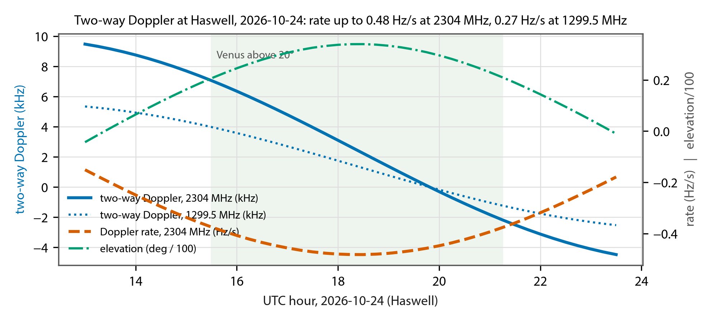

# Earth-Venus-Earth Modem — Design Description and Interface Control Document

<!-- widths: 1.4,5.3 -->
| | |
|---|---|
| Document | DSES EVE Modem Design and ICD |
| Revision | Rev C — DRAFT, updated from the implementation; station reference decided |
| Date | 2026-09-12 |
| Prepared by | Rick Hambly, K0GD, Deep Space Exploration Society |
| Waveform design | Pete Wyckoff, KA3WCA, Open Research Institute ("Venus Bounce Transmitter Spiral #2") |
| Status | Design baseline; parameters marked TBC await confirmation from ORI. Rev C records what building the modem taught (2026-09-11): the frame-numbering and chunk-table semantics, what the pilot can and cannot do, the two-stage receive front end, the arming lead the radio needs, and the state of the validation plan through the B210 loopback bench; it also settles the station time and frequency reference after the Haswell rubidium and NTP server failed (2026-09-12): a Leo Bodnar GPS reference clock that the modem programs and checks itself, proven on the bench with the B210 locked and timed from it and its transmit frequency within 0.03 Hz of the lab reference (7.1, D23, O3; O16 closed, stage 4 complete). Rev B (2026-09-11) carried the team review comments of Michelle Thompson and Alex Nersesian |

This document describes the DSES implementation of the ORI Earth-Venus-Earth (EVE)
waveform for the Venus inferior conjunction of 24 October 2026, and it defines every
interface the implementation touches: the signal on the air, the station hardware, the
timing and frequency references, the files exchanged with other stations, and the boundary
with the DSES Radio Astronomy Workbench. Sections 1 through 5 are the design description.
Sections 6 through 9 are the interface control document (ICD). Section 10 is the decision
and open-issue register. The operator's instructions are a separate, shorter document,
`DSES_EVE_Modem_Operators_Guide` (also the application's Help), so that the person at the
keyboard is not handed forty pages of design. Anything in this document that another team member depends on is
in the ICD sections, so that a change there is a change everyone sees.

The ORI reference material is the EVE repository on GitHub (OpenResearchInstitute/EVE):
the MATLAB simulation in `signal_design/` (May–June 2026), the Python transmit generator
in `signal_design/Python_Implementation/` (August 2026, the current implementation per
ORI), the ORI link budget notebook, and the CAMRAS validation white paper. All ORI code is
GPL-3.0 and is credited to Pete Wyckoff and ORI wherever it is used.

# 1. Purpose and summary

The DSES 60-foot dish at Haswell, Colorado, will attempt to bounce a digital message off Venus near
inferior conjunction and decode the echo. ORI designed the waveform and validated it in
simulation, and ORI has a transmit-side generator that writes the waveform to a SigMF file
for playback through a USRP B210 in GNU Radio. ORI had no receiver when this document was
started; a receiver by the DEFCON group working with ORI was under over-the-air test as of
10 September and is expected in the ORI repository (O14). DSES still needs a complete,
runnable modem: a transmitter that fits the DSES station's duty cycle and keying, a receiver
that decodes echoes, and the synchronization, Doppler, and scheduling machinery that the
reference design assumes away.

The design decisions in this revision:

- **The modem streams.** The transmitter synthesizes the waveform on the fly, driven by a
  schedule, rather than playing a pre-generated file. SigMF export and import are retained
  for interoperability with ORI's files, for bench tests, and for sharing with other
  stations, but they are not how the station transmits (section 3).
- **The 2026 Venus attempt is a 23 cm operation at 1299.5 MHz.** The 13 cm package will
  not be ready this year, so DSES transmits with the 23 cm package retuned from 1296 to
  1299.5 MHz, the frequency Dwingeloo, Stockert, and Effelsberg use. The modem is
  frequency-agile (1296, 1299.5, 2304, 2400 MHz, and others); every frequency-dependent
  quantity is computed per schedule (section 2.4).
- **Monostatic operation is the baseline**, with reception by a European station as the
  upside case at 1299.5 MHz. Computed with ORI's own link-budget classes at the 2026
  distance, the 23 cm monostatic link with the station's 1200 W amplifier is 4.2 dB below
  the design point at ORI's static Venus albedo and 5.4 dB below at ORI's date-resolved
  albedo for conjunction (section 2.2); the DSES matched-bin variant, repeat-and-combine
  over a session, and any European receiver each claw part of that back.
- **The B210 drives the 23 cm amplifier directly.** The EVE25 package's built-in
  transverter covers only 1296 to 1298 MHz, so it is bypassed: the B210 generates 1299.5
  MHz, a 20 W driver raises it to the level the final amplifier needs, and the 1200 W SSPA,
  mounted at the feed, covers 1280 to 1300 MHz (Alex Nersesian, 10 September; Rick, 28
  September; sections 2.3 and 7.1).
- **A DSES-only 23 cm variant of the waveform is defined** (Variant B: 1.5 Hz bins matched
  to the 23 cm Doppler spread, same symbol length), worth about 1.1 dB and selectable per
  schedule. ORI's waveform (Variant A) remains the interoperable one (sections 2.4, 6.1).
- **The message is the station callsign, K0PRT K0PRT**, 11 characters, exactly the 90-bit
  field. It is a schedule parameter, never a code change (section 4.1).
- **EME testing needs no power amplifier.** The B210's own output into the dish gives a
  C/N0 of +12 dB-Hz at 1296 MHz and +16 dB-Hz at 2304 MHz off the Moon, so both bands can
  be tested at and below the design point before either amplifier exists (section 4.6).
- **The 30-minute message is sent in chunks** of up to the Earth-Venus round-trip time
  (272 s on 24 October), with the station listening for the echo of each chunk while the
  amplifier cools. The chunk length is a parameter; 4 minutes is the working value, giving
  one message in about 64 minutes at 47 percent transmit duty (section 4).
- **The ORI Python generator's conventions are the air-interface specification** (section
  6). They differ from the earlier MATLAB simulation in bin width, frame count, bit order,
  and comb placement; ORI confirmed on 9 September that the MATLAB was early simulation and
  the Python is the current implementation. Two numerical inconsistencies in the Python
  are resolved here by definition and flagged TBC.
- **The modem is a separate project from the Workbench.** It reuses the Workbench's proven
  B210 code by factoring that code into an importable module (section 5 and section 9).
- **Doppler is handled on both ends**: ephemeris pre-compensation on transmit so the echo
  arrives at the nominal frequency, and residual tracking on receive. On conjunction day
  the two-way Doppler rate at Haswell reaches 0.48 Hz/s, which is 14 tone spacings across
  one symbol if left uncorrected (section 4.4).
- **Timing comes from GPS**, not a maser. A non-coherent receiver only needs to know which
  0.35-second frame belongs to which symbol; GPS time on the B210 and a shared UTC epoch
  provide that to a millisecond (section 4.3).
- **Validation runs simulation first, then B210 loopback, then a low-power Earth-Moon-Earth
  test, then Venus** (section 5.4). As of 2026-09-12 the modem is implemented through the
  B210 loopback bench: the whole chain from schedule to offline decode ran on the bench
  radio with both message passes decoded (section 5.4).

The waveform is ORI's: Pete Wyckoff, KA3WCA, designed it and Michelle Thompson wrote the
Python implementation that defines the air interface; DSES built the station side, the
receiver and the operations around it. The Acknowledgments at the end say what we owe them.

# 2. Mission context

## 2.1 Geometry on conjunction day

Computed for Haswell (38.3808° N, 103.1561° W, 1311 m) with astropy's built-in ephemeris;
the flight software will use a JPL Horizons table for the operational numbers.

<!-- widths: 1.8,2.8,2.1 -->
| Quantity | 2026-10-24 | Notes |
|---|---|---|
| Earth-Venus distance | 0.273 AU (40.8 million km) | Minimum of the apparition |
| Round-trip light time | 272 s (4.5 min) | Sets the maximum monostatic chunk length |
| Venus above 20° at Haswell | 15:30 – 21:15 UTC (5.75 h) | Rises 13:25, sets 23:30 UTC |
| Maximum elevation | 34° at 18:30 UTC | |
| Angular separation from the Sun | about 6° | Solar noise in the sidelobes raises Tsys; quantify in the link budget |
| Two-way Doppler shift | 1299.5 MHz: +5.3 → −2.5 kHz; 2304 MHz: +9.5 → −4.5 kHz; zero at 19:50 UTC | Scales with frequency |
| Two-way Doppler rate | 1299.5 MHz: up to −0.27 Hz/s; 2304 MHz: up to −0.48 Hz/s (18:30 UTC) | 45 Hz (8 tone spacings) or 79 Hz (14) across one 165 s symbol |

Venus stays within 10 percent of minimum distance from 7 October to 12 November, so the
attempt is a multi-week window, not one day. The round-trip time and Doppler numbers above
change slowly over that window and the schedule generator recomputes them per session.



## 2.2 Link budget

Every row below is computed with ORI's link-budget classes, extracted verbatim from the
ORI notebook into `link_budget/ori_link_budget.py` and driven by `link_budget/dses_cases.py`
in this project, so the table is reproducible with one command when a station number
changes. Inputs: the ORI site dataclasses (DSES 18.29 m at 69 percent, 0.5 dB line losses,
0.4 dB LNA, 30° elevation; Dwingeloo 25 m; Effelsberg 100 m, receive only), ORI's system
noise model, ORI's static Venus radar albedo 0.152, clear sky, and the Earth-Venus distance
of 2026-10-24, 40.8 million km. That distance agrees with the notebook's own ephemeris: its
date-resolved cells compute the Earth-Venus distance with Skyfield and JPL Horizons, 40.81
million km on 2026-10-25 (Michelle Thompson, 2026-09-10). Only the notebook's opening
printout, which brackets the orbit at 38 and 261 million km, is at a fixed distance; the
anchor row reproduces that printout to show the extraction is faithful, and the 2.8 million
km between the bracket and conjunction day is worth 1.2 dB.

<!-- widths: 3.3,0.7,0.6,0.7,1.4 -->
| Case (2026-10-24 distance unless noted) | C/N0 (dB-Hz) | Tsys (K) | Margin to 0 dB-Hz | Basis |
|---|---|---|---|---|
| DSES monostatic, 2304 MHz, 1500 W, at the notebook's 38 million km | +1.7 | 76 | +1.7 | anchor: reproduces the notebook's +1.67 |
| DSES monostatic, 2304 MHz, 1500 W | +0.4 | 76 | +0.4 | 13 cm package, next apparition |
| DSES monostatic, 2400 MHz, 1500 W | +0.7 | 78 | +0.7 | 13 cm alternative band |
| DSES monostatic, 1299.5 MHz, 1500 W | −3.3 | 57 | −3.3 | 23 cm, for comparison: the station amplifier is rated 1200 W |
| **DSES monostatic, 1299.5 MHz, 1200 W** | **−4.2** | 57 | −4.2 | **23 cm package: SSPA rated 1200 W CW (Alex Nersesian, 2026-09-10); power delivered at 1299.5 MHz TBC (O2)** |
| DSES monostatic, 1299.5 MHz, 1000 W | −5.0 | 57 | −5.0 | 23 cm, if the amplifier delivers less than rated |
| DSES monostatic, 1299.5 MHz, 500 W | −8.0 | 57 | −8.0 | 23 cm, half power |
| Dwingeloo monostatic, 1299.5 MHz, 1000 W (cross-check) | −0.9 | 76 | −0.9 | CAMRAS measured +0.65 in March 2025: the model is about 1.5 dB conservative |
| DSES 1200 W transmits, Dwingeloo 25 m receives | −2.8 | 76 | −2.8 | Stockert (25 m) similar |
| DSES 1000 W transmits, Dwingeloo 25 m receives | −3.6 | 76 | −3.6 | |
| DSES 1200 W transmits, Effelsberg 100 m receives | +10.9 | 52 | +10.9 | opportunistic; ORI's Effelsberg proposal |
| DSES 1000 W transmits, Effelsberg 100 m receives | +10.1 | 52 | +10.1 | |
| 2028 apparition, 44.5 million km: DSES monostatic, 2304 MHz, 1500 W | −1.1 | 76 | −1.1 | 13 cm package; a week either side of conjunction |
| 2028: DSES monostatic, 2400 MHz, 1500 W | −0.8 | 78 | −0.8 | |
| 2028: DSES monostatic, 1299.5 MHz, 1500 W | −4.8 | 57 | −4.8 | 23 cm, for comparison |
| 2028: DSES 1500 W at 2304 MHz transmits, Effelsberg receives | +13.9 | 73 | +13.9 | |

**Venus albedo.** The rows above use the notebook's static radar albedo, 0.152, the value
behind the CAMRAS cross-check. The notebook now also integrates the Magellan reflectivity
map over the hemisphere facing Earth on each date (its "Spatially-Resolved" and "Dynamic
Venus Radar Albedo" cells). For the October 2026 conjunction the sub-Earth point falls on
plains and the effective albedo is 0.117, 1.1 dB below the static value; the notebook's
own sensitivity sweep shows the result barely depends on the backscatter model (0.15 dB
from Lambertian to near-specular). DSES carries both: 0.152 as the validated planning
value and 0.117 as the physically motivated pessimistic case (D17, O15).

<!-- widths: 3.1,1.2,1.3,1.1 -->
| Case, 2026-10-24 | Albedo 0.152 (static) | Albedo 0.117 (date-resolved) | Difference |
|---|---|---|---|
| DSES monostatic, 2304 MHz, 1500 W | +0.4 dB-Hz | −0.7 dB-Hz | −1.1 dB |
| DSES monostatic, 1299.5 MHz, 1500 W | −3.3 | −4.4 | −1.1 |
| **DSES monostatic, 1299.5 MHz, 1200 W** | **−4.2** | **−5.4** | −1.1 |
| DSES monostatic, 1299.5 MHz, 1000 W | −5.0 | −6.2 | −1.1 |
| DSES monostatic, 1299.5 MHz, 500 W | −8.0 | −9.2 | −1.1 |

Pete Wyckoff sized the waveform for C/N0 = 0 dB-Hz. Read against that:

- **13 cm, when that package exists**, closes with under a decibel of margin at the 2026
  distance; the notebook's +1.7 dB was at a shorter range than the conjunction offers.
- **23 cm in 2026 does not close in a single monostatic pass.** With the station's 1200 W
  amplifier the shortfall is 4.2 dB, or 5.4 dB at the date-resolved albedo, before solar
  noise. Three things recover it, and the plan uses all three: the DSES Variant B
  waveform is worth about 1.1 dB (section 2.4); repeat-and-combine over five passes in
  the 5.75-hour window is worth 7 dB (section 4.5); and any European station receiving
  with the DSES schedule file changes the picture on its own, Dwingeloo or Stockert by
  1.4 dB and Effelsberg by 15 dB.
- **The model is conservative.** Its Dwingeloo prediction is 1.5 dB below what CAMRAS
  measured in March 2025, so the DSES rows may be pessimistic by a similar amount. That
  is margin to hope for, not to plan on.
- **Every decibel of the transmit chain matters at 23 cm**: the power the amplifier
  actually delivers at 1299.5 MHz, which sits 0.5 MHz inside the top of its 1280 to 1300
  MHz range, under the chunk duty cycle (1200 W rated; 500 W would cost 3.8 dB), the 20 W
  driver's headroom, the feed match, and the receiver Tsys are the open items that decide
  where in the table DSES lands (O2, O4).

**Will monostatic 23 cm succeed in 2026?** Yes, on the model, provided the 23 cm amplifier
delivers close to its 1200 W rating and the receiver combines passes. The 10 percent frame-error
threshold is −0.6 dB-Hz for Variant A and −1.7 dB-Hz for Variant B (section 2.4).
Against the single-pass figures above, the passes that must be combined are:

<!-- widths: 1.3,1.7,1.9,1.8 -->
| 23 cm power | Single pass, albedo 0.152 / 0.117 | Variant B, passes to combine | Margin after 5 passes (+7 dB) |
|---|---|---|---|
| 1500 W | −3.3 / −4.4 dB-Hz | 2 (+3.0 dB) | +5.4 / +4.3 dB |
| **1200 W (rated)** | **−4.2 / −5.4 dB-Hz** | **2 to 3 (+3.0 to +4.8 dB)** | **+4.5 / +3.3 dB** |
| 1000 W | −5.0 / −6.2 dB-Hz | 3 (+4.8 dB) | +3.7 / +2.5 dB |
| 500 W | −8.0 / −9.2 dB-Hz | 5 (+7.0 dB), no margin / does not close | +0.7 / −0.5 dB |

Rayleigh fading (about 1 dB), pointing (0.7 dB two-way), and solar noise at 6° come out of
those margins, and the model's 1.5 dB conservatism goes back in. At the amplifier's 1200 W
rating the message closes on the second or third pass and keeps 3 to 4.5 dB after all
five, which is what fading, pointing, and the Sun consume; at 1000 W it works with the
full window; at 500 W it depends on luck. A single European receiver with the schedule
file removes the question for that session.

**The 2028 apparition.** The next inferior conjunction is 2028-06-01 at 0.288 AU (43.2
million km, round trip 288 s), 6 percent farther than 2026 (−0.5 dB), and on that day Venus
passes only 1.1° from the Sun, too close to point at. A week either side the separation is
10 to 12° at 0.295 to 0.297 AU (44.5 million km, −0.8 dB relative to 2026); two weeks
either side it is 20° at 0.32 AU (−1.4 dB). Venus stands high at Haswell, 72 to 78° at
transit and above 20° for about ten hours a day, which helps Tsys. So 2028 is not an
easier target: it is farther and nearer the Sun. What changes is the 13 cm package: at
2304 MHz with 1500 W the monostatic single pass is −1.1 dB-Hz (Variant A threshold −0.6),
one combined pass short of closing, and Effelsberg receiving would sit at +13.9 dB-Hz.
Whatever is learned at 23 cm in 2026 (real Tsys, real amplifier power, real pointing loss)
is the input that makes the 2028 numbers trustworthy.

ORI's analytic check of the waveform gives a frame error rate of 2 percent at 0 dB-Hz,
38 percent at −1 dB-Hz, and 60 percent at −1.33 dB-Hz (AWGN); Pete's MATLAB channel adds
Rayleigh fading with a 1.05 dB correction, and the DSES receiver validation (section 5.4)
includes that so the margin is stated honestly.

## 2.3 Stations and frequencies

<!-- widths: 1.6,2.3,2.8 -->
| Station | Role in October 2026 | Frequency |
|---|---|---|
| DSES Haswell, 18.3 m | Transmit and receive (this document) | **1299.5 MHz in 2026** with the 23 cm package: the B210 generates 1299.5 MHz directly, the package's transverter (1296 to 1298 MHz only) is bypassed, the 1200 W SSPA covers 1280 to 1300 MHz, and the feed retunes (Alex Nersesian, 2026-09-10; section 7.1). 13 cm package (2304 or 2400 MHz) not before the next apparition |
| Dwingeloo (CAMRAS), 25 m, 1000 W | Transmit and receive, own campaign | 1299.5 MHz only (confirmed by ORI 2026-09-09) |
| Effelsberg, 100 m | Receive only, opportunistic, secondary to a baseline survey | Follows Dwingeloo; proposal alternates 1299.5 and 2304 MHz |
| Stockert, 25 m | Receive, own campaign | 1299.5 MHz |

Because DSES will be on 1299.5 MHz, the European stations can in principle receive DSES
during the mutual window, roughly 13:30 to 16:30 UTC at low elevation on both ends
(estimate, to be computed exactly when a session is arranged); the schedule file of
section 8.1 is what makes that possible. Monostatic remains the baseline because it is the
only mode DSES controls end to end.

## 2.4 Band plan and frequency dependence

The B210 tunes 70 MHz to 6 GHz, and the modem carries the dial frequency in the schedule,
so the same software serves every band. What changes with frequency is computed per
schedule from the ephemeris; what does not change is the waveform itself, which ORI defines
with the same parameters on every band (their own smoke-test file is at 1296 MHz).

<!-- widths: 0.9,1.7,1.5,1.3,1.3 -->
| Band | Use | Two-way Doppler, Venus at conjunction | Peak rate, per symbol | Doppler spread (ORI: 1.5 Hz at 1299.5, scaled) |
|---|---|---|---|---|
| 1296 MHz | EME tests, 23 cm package native | n/a (Moon: about ±2 kHz) | Moon: small | libration, variable |
| 1299.5 MHz | **Venus 2026**; Dwingeloo, Stockert, Effelsberg band | +5.3 to −2.5 kHz | 0.27 Hz/s, 45 Hz (8 spacings) | 1.5 Hz |
| 2304 MHz | 13 cm package, next apparition | +9.5 to −4.5 kHz | 0.48 Hz/s, 79 Hz (14 spacings) | 2.66 Hz |
| 2400 MHz | 13 cm alternative | +9.9 to −4.7 kHz | 0.50 Hz/s, 83 Hz (14 spacings) | 2.77 Hz |

The ORI waveform's 2.87 Hz bin is matched to the Doppler spread at 2304 MHz. At 1299.5 MHz
the spread is 1.5 Hz, so a 2.87 Hz bin is wider than the channel needs and every frame
carries almost twice the noise it has to. DSES therefore defines a second parameter set,
**Variant B**, for its own monostatic 23 cm operation: bins of 1.5 Hz, tone spacing 3.0 Hz,
247 frames per symbol so the symbol length (164.7 s), the message length, and the whole
chunk schedule are unchanged. Everything else, the alphabet, the FEC, the payload, the bit
mapping, the IF offset, is identical to Variant A. Figure 2 shows what it buys under
ORI's own AWGN receiver model: the 10 percent frame-error threshold moves from about
−0.6 dB-Hz to about −1.7 dB-Hz, 1.1 dB. Doubling the symbol to 473 frames (315 s) would
reach −2.8 dB-Hz, but it halves the passes per session and so loses more in
repeat-and-combine than it gains; it is kept as a schedule option only.


Variant B is a different signal on the air: a European receiver built to ORI's numbers
will not decode it. It is therefore used only when DSES is its own receiver; any session
with a partner receiver runs Variant A, and the schedule file names the variant (section
8.1). ORI is being told (O11). The RF package, feed, and amplifier per band are station
items (section 7).


# 3. Architecture

## 3.1 The question: pre-generate or stream

ORI's implementation generates the complete waveform as a SigMF file and plays it through
a B210 with GNU Radio. For a 30-minute message at 250 kS/s that is a 3.6 GB file, valid for
one message and one Doppler profile. DSES will not operate that way, for four reasons:

1. **The station transmits in chunks with gaps** (section 4). A pre-generated file has no gaps; cutting it at run time is the same work as generating it at run time.
2. **Doppler pre-compensation changes continuously** and depends on the date, time, and target. A file generated for one session is wrong for the next.
3. **The waveform is trivial to synthesize**: one complex exponential at a time. At the radio's 1.5 MS/s that is a few million complex multiplies per second, well inside a Python NumPy budget, with no resampling because the tone is generated directly at the radio rate.
4. **Nothing is lost.** The transmit log records the schedule and the symbols, which together are a complete description of what went out; the IQ can be regenerated exactly.

The decision is therefore **stream**. The SigMF path is kept as an export (write ORI-format
files for other stations and for the bench) and as an import (play an ORI file through the
same transmit chain for cross-checks).

## 3.2 System block diagram


The transmitter and receiver share one B210, one schedule, and one Doppler model. The
schedule is the contract between them and, in bistatic operation, between DSES and the
partner station.

## 3.3 Modes

<!-- widths: 1.3,1.6,1.6,2.2 -->
| Mode | Transmit | Receive | Schedule |
|---|---|---|---|
| Monostatic (baseline) | DSES, chunked | DSES, own echo, between chunks | Chunk length ≤ round trip; receive window = chunk + round trip |
| Bistatic transmit | DSES, message repeated; chunked only by the amplifier's duty limits (no echo wait) | Partner station | Chunks of T_on with T_off gaps, repeat count N; partner receives the schedule file. Continuous only if the amplifier can run the full 30 minutes |
| Bistatic receive | Partner | DSES | DSES receives the partner's schedule file |
| EME test | DSES, chunks of ≤ 2.5 s (Moon round trip) | DSES | Same machinery, `target=moon`, shorter symbol |
| Bench | B210 internal leakage, no PA | B210 | Loopback, noise added offline |

# 4. Operating concept

## 4.1 The message and its timing

One message is one BCH codeword: 106 payload bits (90 message bits plus a 16-bit CRC),
encoded to 127 bits, carried in 11 symbols of 12 bits each (132 bit positions, the last 5
zero). Each symbol is one tone held for 473 frames of 1/2.87 s. The numbers:

<!-- widths: 1.5,2.4,2.8 -->
| Quantity | Value | Derivation |
|---|---|---|
| Frame (FFT block) | 0.34843 s | 1 / 2.87 Hz |
| Symbol | 164.808 s | 473 frames |
| Message (11 symbols) | 1812.9 s = 30.2 min | 11 × 164.808 s |
| Payload rate | 0.058 bit/s | 106 / 1812.9 |
| Message text | 11 ASCII characters (90 bits, 8-bit packed): **K0PRT K0PRT** | Schedule parameter |

The message text is not written into code. It is a field of the schedule file (section
8.1, `message.text`) or the session tool's `--message` option; `message.py` only packs it.
The DSES message is the station callsign repeated, **K0PRT K0PRT**, which is 11 characters
and fills the 90-bit field exactly (a 12th character would be truncated). Appendix C gives
the payload, the codeword, and the 11 symbols for that text, computed with ORI's own
generator, as the project's reference test vector.

The frame is the unit everything is scheduled in. Frame k is the k-th frame the session
transmits: it carries symbol floor(k / 473) mod 11 of message repetition floor(k / 5203),
and frames are counted only while the transmitter is on, so the off periods between chunks
do not consume frames. The schedule's chunk table (section 8.1) maps each frame range to
its UTC transmit time; within a chunk, frames follow one another every 1/2.87 s. A receiver
files every frame it receives into the accumulator of the symbol that frame belongs to.
Because detection is non-coherent, frames of one symbol need not be contiguous in time,
which is what makes chunking possible.

## 4.2 Monostatic chunking

DSES listens to its own echo, so the transmitter must be silent when the echo arrives.
With round-trip time RTT, a chunk of length T_on transmitted from t = 0 returns during
[RTT, RTT + T_on]. The next chunk may start at RTT + T_on. The DSES amplifiers add a duty
limit of about 5 minutes on and 4 minutes off. The constraints are therefore
T_on ≤ min(RTT, 300 s) and T_off ≥ max(RTT, 240 s), and the cycle is T_on + T_off.


Shorter chunks are kinder to the transmitter but cost wall-clock time, because every chunk
pays the full round trip in silence:

<!-- widths: 1.3,1.0,0.8,1.6,2.0 -->
| Chunk T_on | Cycle | Duty | Chunks per message | Wall-clock per message |
|---|---|---|---|---|
| 1 min | 5.5 min | 18 % | 31 | 167 min |
| 2 min | 6.5 min | 31 % | 16 | 100 min |
| 3 min | 7.5 min | 40 % | 11 | 78 min |
| **4 min** | **8.5 min** | **47 %** | **8** | **64 min** |
| 4.5 min (= RTT) | 9.0 min | 50 % | 7 | 59 min |


The working value is **4 minutes**: it keeps a 30-second guard below the round trip so a
chunk's own echo never overlaps the next transmission, stays a minute under the amplifier's
5-minute limit, and delivers a message in 64 minutes. On conjunction day the 5.75-hour
window above 20° elevation holds five message passes, which is what repeat-and-combine
needs. Chunk boundaries fall on frame boundaries; a symbol may straddle a gap.

Symbol boundaries and chunk boundaries are independent. The alternative of making each
chunk exactly one symbol (a 165 s chunk, 2.7 min) is a valid setting of the same parameter
and is listed for completeness; it buys nothing the receiver needs and costs 20 percent in
wall-clock time relative to 4-minute chunks.

## 4.3 Time and frequency reference

Pete's design assumes stations sharing a hydrogen maser over White Rabbit. The DSES
receiver is non-coherent, so it needs two things only: to know which frame is which, and to
have the tone land within a fraction of a 2.87 Hz bin for the whole symbol.

- **Time.** A GPS-disciplined 10 MHz and 1 PPS go into the B210's REF IN and PPS IN. The
  modem sets the USRP time to UTC on a PPS edge, so every transmitted sample and every
  received sample carries a UTC timestamp good to well under a millisecond. The schedule
  epoch is a UTC instant; within a chunk, frame boundaries are the chunk's start + j ×
  0.34843 s. The receiver maps arrival time to frame number through the ephemeris
  round-trip time. The tolerance is about one frame: every frame of a symbol carries the
  same tone, so a one-frame grid error costs 1/473 of the symbol's energy (verified in
  simulation, section 5.4), and GPS provides microseconds. The station reference is a
  Leo Bodnar Precision GPS Reference Clock (D23): its output 1 gives the 10 MHz, and its
  output 2, left disabled, carries the receiver's 1 PPS. Should a session ever run
  without a PPS, the modem sets the USRP time from the host's NTP clock instead
  (host-timed mode); that is good to tens of milliseconds against the one-frame
  tolerance, so it is a fallback, not a degradation of the decode.
- **Frequency.** The same GPSDO disciplines the B210's master clock. A B210 on its internal
  TCXO is ±2 ppm, or ±4.6 kHz at 2304 MHz with drift of tens of hertz per session; that
  alone would defeat a 2.87 Hz receiver. Locked to a GPSDO the reference is 1e-11 or better,
  0.02 Hz at 2304 MHz.
- **Ephemeris.** Round-trip time and Doppler come from a JPL Horizons table (topocentric,
  one row per second, fetched before the session and stored with the schedule), with
  astropy plus a local DE440s file as the offline fallback. The two are cross-checked
  before every session.

## 4.4 Doppler

The two-way Doppler at 2304 MHz on conjunction day sweeps from +9.5 kHz to −4.5 kHz across
the pass and its rate peaks at −0.48 Hz/s (Figure 1). Across one 165-second symbol that is
79 Hz, 14 tone spacings; across one 0.35-second frame it is 0.17 Hz, six percent of a bin.
So the frame is short enough that a tone stays put within a frame, and the symbol is long
enough that the tone must be steered.

The modem does both halves:

- **Transmit pre-compensation.** The transmit NCO is offset by −f_D(t) for the designated
  receiver's geometry, so the echo arrives at the nominal comb. For monostatic operation
  that is the Haswell two-way Doppler at the echo's arrival time, t + RTT. For bistatic
  operation it is the uplink Doppler at Haswell plus the downlink Doppler at the partner
  (the schedule file names the receiver so both ends agree on who compensates what).
- **Receive residual tracking.** The receive NCO applies the same model from the receiver's
  side, and a slow tracker corrects the residual from the model's error and the reference's
  drift using the energy of the detected tone. Frames are then on the design grid.

The Doppler model is a first-class part of the schedule file so that an offline receiver at
another station can apply exactly what the transmitter assumed.

## 4.5 Repeat-and-combine and the pilot

Because the message is repeated within a session, the receiver keeps accumulators per
symbol across repetitions. Deciding on the sum over N repetitions is equivalent to N times
the frames per symbol, worth 10 log10 N dB of sensitivity: two passes buy 3 dB, five buy
7 dB. The ORI README suggests exactly this; here it is designed in from the start and the
schedule file carries the repeat count.

An optional **pilot** reserves a known tone for the first 40 frames (14 s) of each chunk.
It costs 6 percent of throughput and lets the receiver check the frequency model and the
signal's presence live, at the start of each chunk. What it can and cannot do follows from
the waveform: a tone that is constant for 40 frames carries timing information only at
its two edges, so the pilot measures the frequency offset well (to R_bw / 8 by summing
the frames' power in a zero-padded FFT) and confirms presence, but at the 0 dB-Hz design
point 40 frames give only about a 2-sigma presence detection and a 1-sigma decision
between adjacent whole-frame epochs. Timing of record is therefore GPS plus the
ephemeris (section 4.3); the pilot is a live sanity check at Venus and a decisive one
at EME strength. The pilot is on for the EME test and for the first Venus sessions; it is
a schedule flag, not a waveform change.

## 4.6 The EME proof test

Everything above is exercised against the Moon before Venus, at very low power. What
changes is parameterized, not rewritten:

<!-- widths: 1.3,2.2,3.2 -->
| Parameter | Venus | Moon |
|---|---|---|
| Round-trip time | 272 s | 2.5 s |
| Chunk length (monostatic) | ≤ 272 s, working 240 s | ≤ 2.5 s (7 frames), alternating TX and RX |
| Two-way Doppler | ±10 kHz, rate ≤ 0.5 Hz/s | ±4 kHz at 1296 MHz, rate small |
| Spread | 2.87 Hz assumed | Libration spread at 1296 MHz can exceed 5.74 Hz; pick a low-libration window or set R_bw from the predicted spread |
| Link | C/N0 −4 to +2 dB-Hz by band and power | B210 output alone (+10 dBm) gives +12 dB-Hz at 1296 or 1299.5 MHz and +16 dB-Hz at 2304 or 2400 MHz (Tsys 60 / 76 K, mean Moon distance); 0 dBm gives +2 and +6 |
| Frequency | 1299.5 MHz (2026) | 1296 or 1299.5 MHz and 2304 or 2400 MHz: both bands, no amplifier needed |

The B210 alone is the transmitter for EME testing. Its +10 dBm output through the feed
lands 12 to 16 dB above the design point, so the test is run at the design point by turning
the B210 output down, or by adding calibrated noise to the archive offline, with no
amplifier in the chain, on either band, as soon as a feed and a transmit/receive switch at
the feed exist (O12). This decouples validation of the modulation and protocol from the
amplifier schedules entirely, which is why it can start before the 23 cm driver and
sequencer exist and long before the 13 cm package.

The EME test proves the schedule and keying at the fastest cadence the design will ever
use, the GPS timing, the Doppler module with a different target, the receiver, and
repeat-and-combine, end to end. Its switching rate (2.5 s alternation) is a station
question recorded in section 10.

# 5. Software design

## 5.1 Module layout

The modem is a Python package `eve/` in this project, pure NumPy/SciPy in the core with GNU
Radio only in the two blocks that touch the radio:

<!-- widths: 1.2,5.5 -->
| Module | Responsibility |
|---|---|
| `params.py` | `EveParams`: R_bw, N_fft, M, N_frames, N_sym, BCH n/k, IF offset, radio decimation, with the Python-Implementation values as defaults and the MATLAB set selectable for reproducing Pete's curve. Derived quantities (modem rate, frame, symbol, message time). |
| `bch.py` | BCH(127,106), t = 3, narrow-sense systematic, generator polynomial octal 11554743 over GF(2^7) with primitive x^7+x^3+1. Encoder and Berlekamp-Massey / Chien decoder. Verified against `galois` and against the Lin & Costello table. |
| `message.py` | Text ↔ 90 bits (8-bit ASCII, zero-padded); CRC-16-CCITT (0x1021, init 0xFFFF); payload assembly; verification on decode. The text itself comes from the schedule. |
| `modem.py` | Symbol packing (MSB first, 132 positions), tone map, the streaming synthesizer (phase-continuous, chunk-gated, Doppler-offset NCO at any sample rate), and the receiver core: frame FFT bank, per-symbol magnitude accumulators, decisions, unpacking. Faithful to the ORI conventions; no Doppler or sync inside. |
| `channel.py` | Pete's `channel.m` (AWGN + random phase + Rayleigh, −1.05 dB) plus a streaming extension with Doppler ramp, timing offset, and gaps. |
| `montecarlo.py` | Success-rate vs C/N0 and vs frames-per-symbol curves; the Rayleigh version of ORI's link check. |
| `doppler.py` | Two-way topocentric Doppler and round-trip time vs UTC for target `venus` or `moon`, from a Horizons table (primary) or astropy + DE440s (fallback); visibility window. |
| `schedule.py` | The block-slot timeline: epoch, chunks, receive windows, frame-to-symbol map, repeat count, pilot flag; JSON in and out (section 8.1). |
| `sync.py` | Pilot detection, frame-grid search (±N frames), residual frequency tracker, repeat-and-combine. Everything the reference design does not have, kept out of `modem.py`. |
| `sigmf_io.py` | Export in ORI's SigMF form (`ori:design` block) plus a `dses:` block; import of ORI files for playback. |
| `gr_blocks.py` | `EveToneSource` (schedule-driven NCO source at the radio rate) and `EveRxSink` (decimate to the modem rate, archive IQ, feed the live accumulators). |
| `radio.py` | B210 setup: external reference and PPS, `ref_locked` readback, UTC time set on PPS (or from the host clock when no PPS is present), IF-offset tune with readback verification, rate readback, GPIO keying line. Factored from the Workbench (section 9). |
| `gpsdo.py` | The Leo Bodnar GPS reference clock over USB HID: status (satellite and PLL lock, signal-loss count), configuration read-back, divider planning, and the preflight that programs the station setting of section 7.1 and waits for lock before the radio opens. |
| `station.py` | Key-down and cooldown interlocks, PA duty enforcement, abort, session log; one flowgraph per session; a simulated radio (delay line plus AWGN) for the software bench. |
| `display.py` | Operator display (PySide6 and pyqtgraph): tone strip, accumulated metric of the current symbol, running decisions with margins, chunk and keying state, radio status, ephemeris, abort. `OperatorPanel` is re-bound to each session; `OperatorWindow` wraps it for the command-line tools. |
| `decode.py` | The offline decode of an archive (the decision of record) and its summary, shared by the tools and the application. |
| `report.py` | The session report PDF (8.4): verdict, decisions with margins per pass, timeline, per-window synchronization, key events. |
| `siggen.py` | The signal generator (5.8, D25): a schedule of on-windows for a requested duration, a CW / two-tone / EVE-waveform source gated by it, a live level control (B210 TX gain and a digital scale), a timed gain sweep, and a one-page report of every level step and key event. |
| `worker.py` | The run in its own process (radio, GPS clock, ephemeris, schedule, session, decode, report), talking to the application over a pipe. A fresh UHD per run: a second USRP source in one process crashed, and the constructor faults intermittently on Windows, so the application retries the open and survives a worker crash. |
| `app.py` | The application (`eve_app.py`, desktop icon): one window for simulation, bench, EME and Venus runs with remembered settings (INI), the operator panel, and the report viewer; every control carries operator help. Runs repeat without restarting the program. |
| `_workbench.py` | Finds the Workbench clone and imports its shared `dses_radio.py` (section 9). |
| `tools/` | `eve_session.py` (plan a session from Horizons, run a schedule on the radio, or simulate it), `eve_decode.py` (offline decode of an archive, the decision of record), `eve_bench.py` (B210 loopback), `eve_txcw.py` (one comb tone into the lab counter: the transmit-frequency check of 5.4); `--gpsdo` on these commands adds the clock preflight. The application (`eve_app.py`) does all of this from the window; the tools stay for scripts and the field log. |

## 5.2 Transmit path

`EveToneSource` produces samples at the radio rate directly: for sample n at time t_n it
outputs A × exp(j × 2π × (f_IF + d(k) × Δf − f_D(t_n)) × t_n + φ), with d(k) the symbol
of frame k, and φ carried across symbol hops so phase is continuous. Outside an on-window
it outputs zeros and the keying line is released. The block never touches a file; the
schedule is its only input. Buffering follows the Workbench's proven practice for the
B210 transmit edge (deep minimum output buffer, real-time mode during a chunk) so a
4-minute chunk runs without underruns; underruns are counted and logged.

The B210 TX/RX A port drives the amplifier chain; RX2 A takes the LNA. The two ports are
always so assigned; the modem refuses to start if the receive port is on TX/RX.

## 5.3 Receive path

A two-stage front end takes the B210 stream (radio rate = 32 × modem rate, nominal
1.5047 MS/s) to the modem rate: a frequency-translating complex band-pass filter mixes the
comb down by the IF offset (plus the bulk Doppler when this receiver is not the
pre-compensated one, stepped once a second from the model) and decimates by 16, then a
sharp low-pass at the intermediate rate decimates by 2. Two stages because the comb fills
the modem-rate Nyquist band exactly (M × 2 R_bw = N_fft × R_bw by construction): the
second stage is flat to 99.5 percent of the bandwidth with its transition centered on
Nyquist, so only the last few tones sit in the transition band and take alias noise. A
single-stage design cut the top tones by 8 dB. `EveRxSink` then writes the stream to the
session archive as complex64 with a JSON sidecar (section 8.2), one file per receive
window, time-stamped from the radio's `rx_time` tags and zero-padded across overflows so
the sample clock stays honest. At 376 kB/s a full 6-hour window is 8 GB;
the archive is always written so any session can be re-decoded offline with a different
schedule, Doppler model, or receiver. In parallel the live receiver runs the 16,384-point
frame FFT bank, files frame magnitudes into the symbol accumulators, and shows the running
symbol decisions and the tone-strip display.

The decoder is deliberately offline-first: the live view is for the operator; the
decision of record is the offline decode of the archive after the session.

## 5.4 Validation plan

<!-- widths: 0.5,2.9,1.8,1.5 -->
| Stage | What | Gate | Status 2026-09-12 |
|---|---|---|---|
| 0 | Reference vectors: ORI generator output for a fixed message; BCH round trip against `galois` | Bit-exact symbols and codeword | Passed: Appendix C bit-exact; BCH matches `galois` on encode and on up to three errors |
| 1 | Modulator: DSES streaming synthesizer vs ORI file for the same message, same rate | Tones and phase match to float tolerance | Passed: phase constant within every symbol against ORI's equation; ORI's own smoke file read back |
| 2 | Receiver in simulation: Pete's channel (Rayleigh) and ORI's AWGN model; frames-per-symbol sweep | Reproduces both curves; Rayleigh margin stated | Passed: Variant A reproduces ORI's table; Variant B +1.1 dB |
| 3 | Streaming realism: Doppler ramp, chunk gaps, wrong epoch; real CAMRAS Venus echoes (March 2025, public) through the FFT bank | Decodes at the design point with a 0.5 Hz/s ramp; pilot recovers a wrong epoch | In part: 0.48 Hz/s ramp pre-compensated and receiver-removed, gaps, one-frame epoch error, four-pass combining all decode in simulation; CAMRAS echoes not yet run |
| 4 | B210 loopback on the bench: 4-minute chunk soak, underruns, reference lock, rate readback, transmit frequency vs the lab GPS reference on the E4438C / 53230A | Zero underruns, frequency within 0.1 Hz | In part (2026-09-11): 22 chunks at minimum TX gain, both passes decoded at about 25 dB margin, no underruns, rate read back 0.3 ppm off nominal. 2026-09-12, on the GPS clock's 10 MHz and 1 PPS: `ref_locked` true, USRP time set on a PPS edge (set error 0.000000 s), both passes decoded at 24 to 26 dB margin; transmit frequency against the lab reference on the 53230A: −0.03 Hz mean at 1,296,025,000 Hz (10 s gate, six readings, 0.012 Hz rms; −0.06 Hz at 1 s gate). Passed; O16 closed |
| 5 | EME at very low power | End-to-end decode at C/N0 near 0 dB with the station's own keying | Not started |
| 6 | Venus, sessions from mid October | | |

## 5.5 Receiver algorithms

For a reviewer who wants to check the receiver against the design rather than take it on
trust, this is what `modem.py`, `sync.py` and `decode.py` do, in the order the samples see
it. Names are the ones in the code.

**Frame metric** (`FrameBank.frame_metric`). Each frame of N_fft = 16,384 baseband samples
at the modem rate is windowed, transformed, and reduced to the M = 4096 candidate-tone
magnitudes (tone d at FFT bin 2d, the ORI placement). The metric of a frame is that
4096-vector; nothing coherent survives a frame boundary, by design (section 4.1).

**Symbol accumulation** (`SymbolAccumulator`). Frame k maps to (repetition r, symbol m,
frame-within-symbol) through the schedule's frame map (`FrameMap`), pilot frames excluded.
The accumulator adds frame metrics per (r, m); `combined()` sums the repetitions the
operator asks for (all of them by default), `decide()` takes the arg-max tone per symbol,
`margin_db()` is the dB gap between the winning tone and the runner-up, and `decode()`
unpacks the 11 symbols to 132 bits (MSB first), runs the BCH(127,106) decoder with t = 3
(`bch.py`), checks the CRC-16 (`message.py`) and returns a `DecodeOutcome` whose `ok` is
true only when the CRC matches. The Monte Carlo in `montecarlo.py` reproduces ORI's frame
error table with exactly this chain (section 5.4, stage 2), which is the evidence that the
accumulation is the non-coherent sum Pete's design assumes.

**Pilot** (`PilotDetector`). A window's first `pilot_frames` frames carry a known tone
(section 4.5). `presence()` sums those frames' metrics and reports the contrast of the
expected tone against the median of the others; `frequency()` zooms an R_bw/8 spectrum
around it for the frequency offset; `search()` slides the frame grid over ±N frames and
takes the offset with the best contrast, returning a `SyncEstimate` (frame shift, frequency
offset, contrast, detected flag). At EME strength this is a solid detection; at the Venus
design point it is a 2-sigma presence check and the timing of record is GPS plus the
ephemeris, as section 4.5 says.

**Epoch without a pilot** (`decode._epoch_shift`, `sync.grid_search`). ORI's generator
sends no pilot, so a receive-only interop run finds the frame epoch by matching the known
symbols of the schedule over ±N frames on the first window; the shift that maximizes the
accumulated metric wins. Verified on synthetic offsets of 0, +4, −3 and +9 frames.

**Frequency tracking** (`FrequencyTracker`). Per-frame decisions are useless at Venus SNR,
so the tracker accumulates an exact zoomed spectrum (R_bw/8) around the tone the schedule
says is being sent, over blocks of frames, and reports the residual offset; the receive
chain's shift follows it. On the bench the residual is zero to two decimals; on the air it
is what remains after the transmit pre-compensation (section 4.4).

**Window processing** (`WindowReceiver.process`). One receive window at a time: optional
pilot search, optional tracking, frame metrics into the accumulator, a `WindowResult` with
the sync estimate and the residual. `decode_archive()` walks the archive's windows in
schedule order, pads a window that ends within a tenth of a frame short (the B210 delivers
49,151 samples where 49,152 were asked, section 8.2), applies the epoch search where there
is no pilot, merges accumulators across windows (`merge_accumulators`) and returns the
decision of record with `summarize()` for the report (section 8.4).

**Thresholds.** The design 2.4 chi-square model gives, for a one-pass decode at 10 percent
message error, −0.6 dB-Hz at 473 frames for Variant A and +11.7 dB-Hz at the 6-frame bench
length; the application quotes the threshold for whatever length is set
(`cn0_threshold_db`, a 6.5 dB-per-decade fit to the model within 0.7 dB).

## 5.6 Process architecture and fault handling

**One run, one process.** Every session runs in a worker process spawned by the
application (`worker.py`, `multiprocessing` spawn context) with a fresh UHD; the two talk
over a pipe with typed messages: `log`, `state` (phase text), `preview` (the schedule
description), `session` (the schedule and radio facts for the display), `frame` (a frame's
metric for the live view), `status` (phase, key and radio text every half second),
`notice` (something the operator must see but that must not stop a timed run), and the
final result. The reason is a fault in UHD 4.10 on Windows: `usrp_source`'s constructor
dies with an access violation in about one open in five when a device is reopened, and
a second source in one process faulted every time. The controller retries a worker that
dies before the session exists up to three times; the window survives a worker crash and
says so. Scripts that spawn workers carry the `if __name__ == "__main__"` guard the spawn
context needs.

**Before any RF.** The worker opens the radio, then the GPS clock preflight (the HID handle
is closed before UHD enumerates, section 7.1), then configures the radio and refuses to
continue without reference lock on the air; it opens the key line and puts every output in
the receive state; it builds the schedule and runs the session preflight (chunk lengths
against the amplifier limits, the sequencer's needed gap, the ephemeris model where the
options require one). Any failure ends the run here with the reason in the log and on
screen.

**During the run.** The keyer thread keys T_lead plus the sequencer's settle time before
each chunk's RF and releases T_lag after; a watchdog releases the transmitter if a chunk
overruns the amplifier limit; a keying fault (a relay board that stops answering) is
logged and shown in the key lamp text, and the run continues under the operator's eye
rather than being killed mid-chunk. Abort, from the button or the watchdog, releases the
transmitter first, then the LNA, stops the streams, and closes the archive so what was
received is still decodable. Receive overflows are measured and zero-padded so the sample
clock stays honest (section 8.2).

**After the run.** The offline decode runs on the archive, the report PDF is written
(section 8.4), the radio is closed with its blocks released and garbage-collected, and the
worker exits. Faults in the decode or the report are logged and do not lose the archive.

## 5.7 Test suite

`tests/` (53 tests, run with `python -m pytest tests -q` in the project environment) are
the executable form of the validation plan:

<!-- widths: 1.6,5.1 -->
| File | Covers |
|---|---|
| `test_eve_core.py` | Stages 0 to 2: Appendix C symbols and codeword bit-exact against ORI's generator; BCH against `galois` on encode and on up to three errors; the DSES synthesizer against ORI's equation; loopback decode on Variants A, B and the MATLAB set; the channel's C/N0 calibration; the chi-square frame model against Pete's channel; streaming decode with timing offsets, gaps and Rayleigh fading |
| `test_eve_session.py` | Doppler and round trip from a Horizons table and from astropy; the schedule's chunking, frame map, JSON round trip and validation; pilot detection, grid search and the tracker on synthetic signals; SigMF export and import |
| `test_eve_station_sim.py` | A whole session on the simulated radio: chunks keyed, archive windows of full length, live and offline decode of both passes, amplifier-limit preflight |
| `test_eve_keyer.py` | Relay frames and checksums; the USB relay board against a fake port; the sequencer's order and states on both outputs; the GPIO-only fallback; board discovery |
| `test_eve_siggen.py` | The generator's schedule (on-time adds up to the duration, chunked under the amplifier limits), the source's tones and gating, the sweep's levels, and a whole generator session on the simulated radio with a sweep and the report |
| `test_eve_gpsdo.py` | The GPS clock's HID report decoding and the divider planner against the vendor's plan |
| `test_eve_display.py` | The operator panel renders headless and binds a session |
| `test_eve_app.py` | The application end to end, headless: settings, schedule preview, a simulated run through the worker process, the report rendered, a re-decode, a second run |

## 5.8 Signal generator for the RF package

Integrating the transmit chain (the 20 W driver, the 1200 W SSPA at the feed, filters, and the feed,
7.1) needs a source that behaves like the modem, keys like the modem, and can be turned
up and down while a power meter or spectrum analyzer watches the output. Rather than a
separate instrument on the bench, the modem has a **signal generator run mode**
(`siggen.py`, `eve_app.py` mode "Signal generator"; operator's guide 4.6):

- **Signals.** CW at the dial frequency plus an offset; two equal tones at a set spacing
  (intermodulation and compression); or the EVE waveform itself with the pilot, exactly
  the session's transmission. The CW and two-tone sources are phase-continuous NCOs at
  the radio rate, gated by the schedule's on-windows like `EveToneSource`.
- **Operation and keying.** The generator is an instrument, not a schedule: it comes up
  with the key up and stays up until the operator stops it. KEY and UNKEY on the Run tab
  go through the sequencer (D24) with the session's key lead and lag, as often as the
  operator likes. With the amplifier in the chain the 7.2 limits apply per key-down
  (released at T_on,max, refused until T_off,min has passed); a watchdog releases the
  transmitter if the program stops ticking; Abort releases it first. Nothing is received
  or decoded. (The first 1.0.7 generator ran for a set duration; the operator's bench
  work showed that keying at will is what integration needs, 2026-09-23.)
- **Level and signal, live.** The B210 TX gain (0 to 89.75 dB in 0.25 dB steps, set on
  the device while streaming) is the coarse control and a digital multiplier before the
  sink (dB below full scale) the fine one; the signal kind, offset and spacing change the
  source at its next sample block. All apply immediately from the Setup tab, keyed or not,
  and every change is logged with its UTC time. A timed sweep steps the gain from a start
  to a stop level by a step, holding each for a set time, on the first key-down and on
  request, so a compression curve is one run against the meter's readings.
- **Dry run.** The same run on the simulated radio, with the USB relay board and the
  simulated GPIO lines: the station's wiring to the relays is checked with no RF at all.
- **Report.** One page: settings, every level step, every key event, with times, in
  the archive folder beside the schedule file.

Reading the power meter and the spectrum analyzer into the report (the lab's
instruments are reachable over the network) is a planned extension (O18).

# 6. ICD part A — the air interface

This section is the interoperability specification. It follows the ORI Python
implementation exactly where that implementation is definite, and it resolves, by
definition, two places where it is not. Items marked TBC are awaiting confirmation from
Pete Wyckoff and Michelle Thompson (asked 2026-09-09).

## 6.1 Waveform parameters

<!-- widths: 1.5,0.9,1.4,2.9 -->
| Parameter | Symbol | Value | Source and notes |
|---|---|---|---|
| Modulation | | 4096-ary orthogonal FSK, non-coherent | Pete Wyckoff, Spiral #2 |
| FFT bin width = frame rate | R_bw | 2.87 Hz | ORI Python; equals the Doppler-spread forecast at 2304 MHz, applied by ORI on every band. TBC: the MATLAB used 2.67 Hz; see O11 for 23 cm |
| Tone spacing | Δf | 5.74 Hz (= 2 R_bw) | One guard bin between tones |
| Alphabet | M | 4096 tones, 12 bits per symbol | |
| Frames per symbol | N_frames | 473 | ORI Python; its README notes Pete's slide shows about 440. TBC |
| Symbol duration | T_sym | 164.808 s (= 473 / 2.87) | Defined as an integer number of frames. ORI Python uses 164.794 s (472.96 frames); the 14 ms difference is resolved here in favor of whole frames |
| Symbols per message | N_sym | 11 | |
| Message duration | T_msg | 1812.9 s | |
| Occupied bandwidth | | 23.5 kHz (4096 × 5.74 Hz) | |
| FEC | | BCH(127,106), t = 3, narrow-sense, systematic (message bits first) | Generator octal 11554743; identical in MATLAB and Python |
| Payload | | 90 message bits + CRC-16-CCITT (0x1021, init 0xFFFF, no reflection) over the 90 bits, MSB first | ORI Python |
| Message text | | 11 ASCII characters, 8 bits each, MSB first, zero-padded to 90 bits | 90 bits = 11.25 characters; the 12th is truncated |
| Bit-to-symbol map | | 127 coded bits zero-padded to 132; symbol m = bits 12m … 12m+11, first bit most significant | ORI Python. The MATLAB used LSB first |
| Amplitude | A | constant, 0.8 of full scale in ORI files | Constant envelope; Class-C amplifier compatible |
| Phase | | continuous through a symbol; at symbol hops DSES keeps phase continuous (ORI files restart from a global index). Receiver-invisible | |

### 6.1.1 Variant B — DSES 23 cm monostatic

Selected by `waveform.variant = "B"` in the schedule. Only the rows below differ from
Variant A; a receiver that does not implement Variant B must refuse a Variant B schedule.

<!-- widths: 1.6,1.1,1.2,2.8 -->
| Parameter | Variant A (ORI) | Variant B (DSES 23 cm) | Note |
|---|---|---|---|
| Bin width = frame rate, R_bw | 2.87 Hz | 1.5 Hz | matched to the 1.5 Hz spread at 1299.5 MHz |
| Tone spacing, Δf | 5.74 Hz | 3.0 Hz | still one guard bin |
| Frame length | 0.34843 s | 0.66667 s | = coherence time at 23 cm |
| Frames per symbol, N_frames | 473 | 247 | symbol 164.67 s, message 1811.3 s: schedule unchanged |
| Occupied bandwidth | 23.5 kHz | 12.3 kHz | same 25 kHz IF offset |
| Modem sample rate, N_fft × R_bw | 47,022.08 S/s (N_fft 16,384) | 24,576 S/s (N_fft 16,384) | radio rate 32× = 786,432 S/s |
| Performance (AWGN model, 10 % FER) | −0.6 dB-Hz | −1.7 dB-Hz | +1.1 dB |
| Interoperable with ORI receivers | yes | **no** | DSES monostatic only |

## 6.2 Tone map and spectral placement

Tone d (0 … 4095) is at baseband frequency f_d = d × Δf above the comb origin, one-sided,
0 to 23,505 Hz. The comb origin sits at an IF offset above the dial frequency so that tone 0
is not on the zero-IF spike:

f_RF(d) = f_dial + f_IF + d × Δf, with **f_IF = 25,000 Hz** and Δf = 5.74 Hz (Variant A) or
3.0 Hz (Variant B).

Published operating parameters are therefore two numbers: f_dial (the frequency the
transmitter is tuned to) and f_IF (25 kHz unless a schedule says otherwise). The comb
occupies f_dial + 25.0 kHz to f_dial + 48.5 kHz. A receiver tunes to f_dial, mixes down by
f_IF plus the applicable Doppler, and sees tone d at d × 5.74 Hz. This is the ORI
convention (their README: "tune the B210 25 kHz low"). The MATLAB placed the comb
symmetrically about DC; that convention is not used on the air.

## 6.3 Receiver reference implementation

- Frame length 1 / R_bw (0.34843 s for Variant A, 0.66667 s for Variant B). The modem
  sample rate is defined as N_fft × R_bw with **N_fft = 16,384, giving 47,022.08 S/s
  (Variant A) or 24,576 S/s (Variant B)**, so a frame is exactly 16,384 samples and tone d
  is exactly FFT bin 2d in either variant. Any radio rate is bridged to this by resampling (DSES: 32 × modem
  rate at the B210, integer decimation).
- Per frame: FFT of the frame, magnitude at the 4096 candidate bins.
- Per symbol: sum of frame magnitudes over the frames scheduled for that symbol (linear
  magnitude combining, as in Pete's `runTest.m`; power combining is an accepted alternative
  with equivalent performance and is what the ORI AWGN check assumes).
- Decision: argmax over the 4096 tones. Symbol 10 (the last) carries only 7 data bits;
  restricting its argmax to the 128 tones with the 5 padding bits zero is a documented
  option (off = faithful to ORI).
- Unpack 11 symbols MSB first to 132 bits, take the first 127, BCH-decode (up to 3 bit
  errors), split 90 + 16, check the CRC.

## 6.4 Frame and schedule timing

- Frames are numbered k = 0, 1, 2 … over the frames the session transmits. The schedule's
  chunk table gives each chunk its first and last frame and its transmit start t_c (UTC);
  frame k of that chunk occupies transmit time [t_c + (k − k_first) × T_frame, t_c +
  (k − k_first + 1) × T_frame). A continuous session is one chunk with t_c = t_0.
- Symbol index m(k) = floor(k / N_frames) mod N_sym; repetition r(k) = floor(k / (N_frames × N_sym)).
- A transmitter emits only the frames in the chunk table; between chunks it is silent and
  no frames are consumed.
- A receiver expects frame k at its transmit time + RTT(t), where RTT is evaluated at the
  transmit time from the schedule's ephemeris, and files it into accumulator (r, m(k)).
  The frame grid need only be right to about one frame (section 4.3).
- Optional pilot: the first N_pilot frames (default 40) of every on-window carry tone
  d_pilot (default 2048) instead of the message symbol; the receiver excludes them from the
  symbol accumulators.

## 6.5 Doppler convention

The schedule names the receiver. The transmitter pre-compensates so that the tone arrives
at the receiver at f_RF(d) as defined in section 6.2: it transmits at f_RF(d) − f_D(t),
where f_D is the two-way (monostatic) or uplink-plus-downlink (bistatic) Doppler for the
named receiver at the echo's arrival time. A receiver with the schedule file applies no
bulk correction, only residual tracking. A receiver without the transmitter's schedule
applies its own ephemeris for the full two-way Doppler.

# 7. ICD part B — the station

These are the interfaces between the modem software and the Haswell station. Values in
square brackets are the modem's assumptions; the station team owns the actual numbers and
the entries marked TBD need them.

## 7.1 Radio

<!-- widths: 1.2,5.5 -->
| Interface | Specification |
|---|---|
| Radio | Ettus USRP B210, one unit, owned exclusively by the modem process during a session. Tunes 70 MHz to 6 GHz; the dial frequency is a schedule parameter (1296, 1299.5, 2304, 2400 MHz, and others) |
| Transmit port | TX/RX A. Venus: to the 20 W driver of the amplifier chain below; B210 output [+10 dBm maximum], the modem runs A = 0.8 (−2 dB) at full TX gain unless the driver's input requirement says otherwise. EME tests: directly to the feed through the transmit/receive switch, no amplifier; output set by TX gain to the wanted C/N0 (section 4.6) |
| Transmit chain, 23 cm | B210 → 20 W driver amplifier (a station build) → final SSPA, mounted at the feed → feed. The driver is a 20 W stage (Rick, 2026-09-28, superseding the 2 W driver of 2026-09-10; the SSPA data excerpt reads 1280 to 1300 MHz, 1200 W CW peak output, 20 to 30 W typical input), +43 dBm, 33 dB above the B210's +10 dBm maximum. TBC with the station team: the driver's exact drive into the SSPA, where the driver is mounted, and the pad that keeps the B210 from overdriving it (O4). The comb sits 25 to 48.5 kHz above the 1299.5 MHz dial, 0.45 MHz inside the amplifier's upper band edge. The package's built-in transverter (RF 1296 to 1298 MHz, IF 144 to 146 MHz) is not used |
| Receive chain, 23 cm | Feed → LNA → bandpass filter (optional, recommended by the station team) → RX2 A. The filter keeps out-of-band power off the B210 front end; its passband must cover 1299.5 MHz plus 0 to 50 kHz, and its loss is charged to the receive line loss of the link budget (0.5 dB assumed) |
| Package modules | Two of the EVE25 package's three modules are used, the final SSPA and the CMU (its control and monitoring unit), both mounted at the feed (Rick, 2026-09-28); the RF module, which is the transverter, is not (Alex Nersesian, 2026-09-10) |
| Receive port | RX2 A, from the LNA. RX gain set for the receiver noise to sit 10–15 dB above the B210 floor (verified live with the tone-strip display) |
| Cabling to the RF package | The B210 has separate transmit and receive ports, so the runs to the RF package at the feed are: one coax carrying transmit drive from TX/RX A, one coax carrying the LNA output to RX2 A, and the two key lines from the USB relay board, TX key to the amplifier and LNA key to the LNA (Rick, 2026-09-10 and 2026-09-28). The GPS clock sits beside the B210 with two short coax runs (10 MHz to REF IN, PPS to PPS IN) and a USB cable to the host; its GPS antenna needs a sky view. TBD: run lengths, losses at 1299.5 and 2304 MHz, and connector types at each end |
| Sample rate | 32 × modem rate: 1,504,706.56 S/s (Variant A) or 786,432 S/s (Variant B); actual UHD rate read back (the bench B210 runs 1,504,707.01 S/s, 0.3 ppm high) and the residual absorbed by the frequency tracker |
| Tuning | f_dial with the verified LO-offset method inherited from the Workbench, in both directions: the LO is parked 300 kHz below the dial frequency so its leakage sits far outside the receive front end's passband and never aliases into the comb (with the LO on the dial frequency, its leakage 25 kHz below tone 0 would fold into the comb after decimation). If the offset cannot be applied honestly the radio says so and the session tool decides |
| Reference | The station reference is a Leo Bodnar Precision GPS Reference Clock (the dual-output model, USB HID; D23), replacing the HP5065A rubidium and the site NTP server that failed in September 2026. Output 1, 10 MHz at drive level 1 (16 mA, about +11 dBm into 50 Ω), to the B210 REF IN, whose limit is +15 dBm. Output 2 disabled: in that state the OUT2 connector carries the GPS receiver's 1 PPS (3.3 V CMOS, 200 ms high; measured 2026-09-12 with firmware 1.7), to the B210 PPS IN, whose window is 1.8 to 5 V. The modem programs exactly this setting over USB at every start (`eve/gpsdo.py`, `--gpsdo`), waits for satellite and PLL lock (60 s limit; the PLL drops for a few seconds after reprogramming), and refuses to start a session unless the clock is locked and the B210's `ref_locked` reads true (the sensor reports lock to an external or GPSDO reference only; it reads false on the internal reference). Verified on the bench 2026-09-12: locked, timed from the PPS, decoded (section 5.4). Any GPSDO with a 10 MHz output between +3 and +15 dBm and a 1.8 to 5 V PPS would serve instead |
| Time | USRP time set to UTC at a PPS edge, the second number taken from the host's NTP clock (internet NTP at the site, good to well under half a second, which is all the PPS-edge set needs); verified against a second PPS before the session (bench: set error 0.000000 s). Without a PPS the modem sets the time from the host clock alone (`--time-source host`, tens of milliseconds, inside the one-frame tolerance) and says so in the session log. The sample clock is then the schedule clock: the transmit stream starts at a device time given by a `tx_time` tag and the receive stream at the same time, so sample n is device time t_0 + n / f_s exactly |
| Device open | The application opens the B210 in a fresh worker process for every run (section 5.1, `worker.py`): on this Windows build the USRP source constructor faults about one time in seven with nothing else on USB, and a second source in one process faulted every time on the desktop; the worker settles 2 s, opens the device before it talks to the GPS clock over USB, and the application retries a failed open up to three times. About 13 s per open with the FPGA image load |
| Arming | Starting the flowgraph with both USRP streamers takes about 4 s on the Windows bench, so the session arms the streams [8 s] before the first scheduled sample. A late timed start drops the whole transmit stream and the receive start command, which is how this number was learned |

## 7.2 Keying and sequencing

<!-- widths: 1.2,5.5 -->
| Interface | Specification |
|---|---|
| Keying outputs | Two signals, TX key and LNA control, sequenced by the modem (D24). At DSES they are the two relays of the USB relay board (DIUSTOU DSTUR-T20, 2 channels, optocoupler isolated, USB-C, native USB serial; `docs/hardware/diustou_dstur_t20.md`): relay 1 = TX key, relay 2 = LNA control, each an SPDT contact (COM, NO, NC; 10 A), on separate lines to the amplifier and to the LNA at the feed. The modem drives the same two signals in parallel on the B210 J504 GPIO (10-pin 2.54 mm header; on the DSES clone the front-panel 2x5 header labeled with the GPIO numbers): GPIO_0 = TX key, GPIO_1 = LNA, 3.3 V LVCMOS, for a station with its own external sequencer at the feed, as ORI's, and only through an external isolating circuit, never straight to station inputs; DSES does not use the GPIO outputs (Rick, 2026-09-28). Polarity: energized / high = transmit, energized / high = LNA off; both released / low = receive, so a board that is unplugged, a PC that is off, or lines that are not driven leave the feed in receive. GPIO_0 alone may drive an external sequencer (DB6NT style), GPIO_1 then being ignored. The board is found on whatever COM port it has (a status query must answer); a run without it proceeds on the GPIO lines and the operator is told, which at DSES, where the GPIO lines are not wired, keys nothing. Host-timed (D22); a keying fault is logged and shown, the run continues under the operator's eye; a watchdog releases the transmitter first if a chunk overruns |
| Sequencer timing | LNA off; guard [50 ms default, Setup]; TX key asserted; [T_lead = 200 ms]; first non-zero sample ... RF stopped; [T_lag = 100 ms]; TX key released; release [50 ms default]; LNA on. Abort and session end take the same way out, transmitter first. The guard and release times are operator settings until the station's LNA and amplifier requirements are measured (O5) |
| Duty limits | The modem enforces T_on ≤ [300 s] and T_off ≥ [240 s] per chunk regardless of the schedule; a schedule violating them is refused. TBD: the amplifier's true thermal limits and whether 4-minute chunks are acceptable. The thermal test needs a 2 kW 50 Ω load with a 7/16 DIN connector, which the station does not yet have (O6) |
| Abort | Operator abort or any fault (reference unlock, underrun burst, USB error) releases the key immediately and logs the frame number |
| EME cadence | Monostatic Moon operation alternates transmit and receive every ≤ 2.5 s. TBD: whether the station's transmit/receive switching can follow that; if not, EME runs bistatic with a second receive antenna, or DSES transmits only and a partner receives |

## 7.3 Feed and pointing

<!-- widths: 1.2,5.5 -->
| Interface | Specification |
|---|---|
| Feed | 23 cm feed retuned from 1296 to 1299.5 MHz for 2026 (an easy retune per Alex Nersesian, 2026-09-10); 13 cm feed (2304 / 2400 MHz) when that package exists. A feed change is a station operation; the modem does not control feeds |
| Pointing | The modem does not steer the dish. It computes and displays Venus azimuth and elevation from the ephemeris for the operator. The measured 0.15° boresight offset is 0.7 dB two-way at 23 cm (0.88° beam) and 2.2 dB at 13 cm (0.50° beam); the pointing corrections memo of 2026-09-07 covers it |

# 8. ICD part C — data and files

## 8.1 Schedule file

One JSON document per session, produced by `schedule.py` and shared with any partner
station. It is the complete contract; a receiver needs nothing else.

```
{
  "schema": "dses-eve-schedule/1",
  "session_id": "DSES-EVE-20261024-A",
  "target": "venus",                      # venus | moon
  "epoch_utc": "2026-10-24T15:30:00Z",     # frame 0 transmit start
  "transmitter": {"site": "DSES Haswell", "lat": 38.380833, "lon": -103.156111, "alt_m": 1311},
  "receiver":    {"site": "DSES Haswell", "mode": "monostatic"},
  "rf": {"f_dial_hz": 2304000000, "f_if_hz": 25000},
  "waveform": {"variant": "A", "r_bw_hz": 2.87, "n_fft": 16384, "m": 4096, "n_frames": 473,
               "n_sym": 11, "bch": [127, 106], "crc": "CRC-16-CCITT",
               "bit_order": "msb_first", "amplitude": 0.8, "phase": "continuous"},
  "message": {"text": "K0PRT K0PRT", "payload_bits": "<106 bits, Appendix C>",
              "codeword_bits": "<127 bits, Appendix C>",
              "symbols": [1203, 80, 1317, 1056, 1203, 80, 1317, 1031, 289, 3894, 3168]},
  "repeat_count": 5,
  "pilot": {"enabled": true, "n_frames": 40, "tone": 2048},
  "chunks": [ {"index": 0, "frame_first": 0, "frame_last": 688,
               "tx_start_utc": "…", "tx_stop_utc": "…",
               "rx_start_utc": "…", "rx_stop_utc": "…"}, … ],
  "doppler": {"model": "horizons", "table": "horizons_venus_haswell_20261024.csv",
              "convention": "tx_precompensated_for_receiver"},
  "limits": {"t_on_max_s": 300, "t_off_min_s": 240},
  "generated_by": "dses-eve 0.1", "generated_utc": "…"
}
```

The symbols listed are the transmitted symbols; a partner receiver may use them to score
its decode directly.

## 8.2 Receive archive

`<session_id>_<NN>.eve.iq` — complex64, little-endian, interleaved I/Q at the modem rate
with tone 0 at DC, one file per receive window (NN = chunk index), plus
`<session_id>_<NN>.json` (`schema: dses-eve-archive/1`) with: the start of the first
sample as device time and UTC (from the radio's `rx_time` tags), the receive window,
sample rate and datatype, sample count, the first frame number and the first sample's
offset into it in frames, f_dial, f_IF, whether the transmitter pre-compensated and
whether the model Doppler was removed on receive, the radio description, the overflow
gap count and list, and the waveform parameters. The archive is what the offline decoder
reads and what is shared for independent decoding. It is written at the modem rate at
baseband deliberately: an IF-offset stream at the modem rate would alias, since the comb
is half the modem rate wide.

## 8.3 SigMF interchange

Export writes ORI's format: `core:datatype cf32_le`, `core:sample_rate`, the `ori:design`
block with the same keys as ORI's generator, per-symbol annotations, and an additional
`dses:schedule` block that embeds the schedule file. Import accepts ORI's files as
produced by `eve_tx_sigmf.py` and plays them through the DSES transmit chain unchanged,
for cross-checks against the streaming synthesizer.

## 8.4 Session log and report

Every session writes `<session_id>_session.json` (start and finish UTC, radio
description, key events with device times, chunks keyed, frames sent, the receive report
with gap counts and file list, the live decode, abort state and reason, the schedule and
the options that ran) and, after the offline decode, a one-page PDF report in the DSES
house style: schedule summary, tone-strip image per symbol, decoded symbols
against the transmitted ones, BCH corrections used, CRC result, and estimated C/N0 from the
accumulators. The report is the deliverable of a session.

Every run from the application also writes `<session_id>_report.pdf` beside the log: the verdict of the offline decode, the decisions with margins per pass, the chunk timeline with key events, the per-window synchronization (pilot offset, tracker residual, gaps), and the key-event list. The application shows it when the run ends; `Re-decode` rebuilds it from the archived windows.

# 9. ICD part D — the Workbench boundary

The modem is a separate project. The interface to the DSES Radio Astronomy Workbench is a
code-sharing boundary, not a runtime one:

- The Workbench's B210 classes (device discovery, `UhdB200Source`, the verified LO-offset
  tune path, the deep-buffer and real-time-mode helpers) are factored out of
  `dses_workbench.py` into an importable module that both projects use. Done 2026-09-11:
  `dses_radio.py` in the Workbench repository, shipped with it; the Workbench imports the
  same names and its behavior is unchanged; the modem finds the Workbench clone (or the
  `DSES_WORKBENCH` variable) and imports the module from there. New in it for the modem:
  the tune path as a function usable on a transmit sink, reference and PPS time-set
  helpers, and the GPIO keying line.
- The Workbench's `FilterbankSink` pattern (a GNU Radio sink with a deep queue and a close
  method that reports gaps) is the template for `EveRxSink`.
- The pulsar planner's site and visibility code is reused for the Venus and Moon windows.
- The Workbench keeps its rule that its own transmitter is locked at minimum gain. Real
  transmit drive exists only in the EVE modem, behind the interlocks of section 7.2.
- One B210 belongs to one process. During an EVE session the modem owns the radio; the
  Workbench is not running on it.

# 10. Decisions and open issues

## 10.1 Decisions taken in this revision

<!-- widths: 0.55,3.2,2.95 -->
| # | Decision | Rationale |
|---|---|---|
| D1 | Stream the waveform; SigMF is export/import only | Chunking, live Doppler, no multi-GB files; nothing lost since schedule + symbols regenerate the IQ |
| D2 | Monostatic baseline, 4-minute chunks | The only mode DSES controls; European receivers at 1299.5 MHz are the upside via the schedule file. 4 min stays under both the round trip and the PA limit; 64 min per message |
| D3 | ORI Python conventions are the air-interface spec; MATLAB set selectable for simulation only | ORI: the Python is the current implementation |
| D4 | T_sym defined as 473 whole frames; modem rate defined as 16,384 × 2.87 Hz | Removes the two non-integer artifacts in the ORI numbers |
| D5 | GPS time and GPSDO reference replace the maser | Non-coherent detection needs frame assignment and frequency, not phase |
| D6 | Doppler pre-compensated on transmit for the named receiver, residual tracked on receive | 79 Hz per symbol uncorrected |
| D7 | Pilot frames on for EME and early Venus sessions | Cheap live check of timing and Doppler |
| D8 | Receiver is offline-first; raw archive always written | Any session re-decodable with a better receiver |
| D9 | Separate project; Workbench radio classes factored into a shared module | Different operational character; keeps the Workbench release train clean |
| D10 | Phase-continuous symbol hops | Cleaner for the Class-C chain; invisible to a non-coherent receiver |
| D11 | Frequency-agile modem: dial frequency per schedule; ORI waveform parameters unchanged on every band | 23 cm in 2026, 13 cm later, EME on both; interoperability with the 1299.5 MHz stations |
| D12 | EME tests use the bare B210 as the transmitter | +12 to +16 dB-Hz off the Moon with no amplifier; validation decoupled from amplifier schedules |
| D13 | Variant B (1.5 Hz bins, 247 frames) defined for DSES monostatic 23 cm; Variant A for any session with a partner receiver | +1.1 dB where DSES needs it most; schedule names the variant |
| D14 | Message text = K0PRT K0PRT, a schedule parameter | Station callsign, fills the 90-bit field exactly |
| D15 | Link budget rows come from ORI's own classes, run by `link_budget/dses_cases.py` at the 2026 distance | Reproducible; one command when a station number changes |
| D16 | The B210 generates 1299.5 MHz directly; the EVE25 transverter is bypassed and a 20 W driver feeds the final SSPA, which is mounted at the feed | The transverter covers 1296 to 1298 MHz only; the SSPA covers 1280 to 1300 MHz (Alex Nersesian and Rick, 2026-09-10); driver rating and amplifier location corrected by Rick, 2026-09-28 |
| D17 | The link budget is stated at ORI's static albedo (0.152) and at ORI's date-resolved albedo for conjunction (0.117) | Michelle Thompson's review of 2026-09-10: the notebook resolves distance and albedo per date; DSES plans on the value behind the CAMRAS cross-check and carries the 1.1 dB pessimistic case |
| D18 | Frames count transmitted frames; the chunk table maps frame ranges to UTC | Off periods consume no frames, so a message is 5,203 transmitted frames however it is chunked (sections 4.1, 6.4) |
| D19 | Timing of record is GPS plus the ephemeris; the pilot measures frequency offset and presence and checks the epoch to a whole frame | A steady tone carries timing information only at its edges; a one-frame grid error costs 1/473 (sections 4.3, 4.5) |
| D20 | Two-stage receive front end, flat to 99.5 percent of the bandwidth | The comb fills the modem-rate Nyquist band exactly; one stage cut the top tones by 8 dB (section 5.3) |
| D21 | Bistatic transmit is chunked by the amplifier's duty limits | The 30-minute message exceeds the 5-minute on-limit; the partner's non-coherent receiver does not care about gaps (section 3.3) |
| D22 | Host-timed keying with an 8 s arming lead for the radio streams | Timed GPIO did not defer on the bench build; flowgraph start with two streamers takes about 4 s (sections 7.1, 7.2) |
| D23 | The station reference is a Leo Bodnar GPS reference clock, programmed by the modem: output 1 = 10 MHz at level 1, output 2 disabled = 1 PPS; internet NTP for the host clock | The HP5065A rubidium and the site NTP server failed (Rick, 2026-09-12); the clock's lock, the B210's lock to it, and the PPS-edge time set were proven on the bench the same day (section 7.1, 5.4) |
| D24 | The modem is the station sequencer: it drives the TX key and the LNA control itself, on the two relays of a USB relay board (the DSES keying path), with the safe order and guard times; both signals released = receive. The B210 GPIO_0 / GPIO_1 carry the same two signals in parallel but are not used at DSES | The station has no sequencer (Alex Nersesian, 2026-09-14). Fail-safe by polarity: nothing driving the lines leaves the LNA active and the transmitter off. The GPIO pair serves a station with an external sequencer at the feed, as ORI's. Rick, 2026-09-23 and 2026-09-28 (section 7.2) |
| D25 | The modem carries its own bench signal generator: CW, two-tone or the EVE waveform, keyed and unkeyed at will through the sequencer until stopped, signal and level adjustable live (TX gain and a digital scale) or stepped on a timer, with a dry run on the simulated radio | Integrating the driver, the SSPA and the feed needs a source that keys and times like the modem; a laboratory generator does not exercise the sequencer wiring. Meter integration deferred (O18). Rick, 2026-09-23 (section 5.8) |

## 10.2 Open issues

<!-- widths: 0.55,3.6,1.4,1.15 -->
| # | Issue | Owner | Needed by |
|---|---|---|---|
| O1 | Confirm R_bw = 2.87 Hz and N_frames = 473 (vs 440 on the slide, 540 in MATLAB) | Pete Wyckoff / ORI | Before stage 2 |
| O2 | 23 cm amplifier: the power actually delivered at 1299.5 MHz (rated 1200 W CW, −4.2 dB-Hz monostatic; the frequency is 0.5 MHz inside the top of its 1280 to 1300 MHz range) under the chunk duty cycle, and the receive Tsys. The retune question is closed: transverter bypassed, feed retunes (D16) | DSES station team (Alex, Roger) | Before Venus |
| O3 | Closed in Rev C (D23): the Leo Bodnar GPS clock, 10 MHz at level 1 and the PPS from the disabled output 2, two short coax runs to the B210. Still to place at the site: the clock's GPS antenna with a sky view, and the host's internet NTP | DSES station team | Before EME test |
| O4 | Drive chain: a 20 W driver between the B210 (+10 dBm) and the SSPA at the feed is a station build (Rick, 2026-09-28; the SSPA excerpt reads 20 to 30 W typical input). Still to settle: the driver's exact drive into the SSPA, where the driver is mounted, and the pad so the B210 cannot overdrive it | DSES station team | Before bench stage 4 |
| O5 | Keying interface: CLOSED in principle by D24 (the modem sequences; relay contacts and GPIO lines defined in 7.2). Still needed from the station: what the LNA side switches (DC, a coax relay coil, or a logic input), the amplifier's own lead requirement, and the guard times to set; then whether 2.5 s alternation is possible for monostatic EME | DSES station team | Before EME test |
| O6 | PA thermal limits: are 4-minute chunks with 4.5-minute cooldown acceptable for a 6-hour session? The test needs a 2 kW 50 Ω load with a 7/16 DIN connector, not yet on hand | DSES station team | Before Venus |
| O7 | Solar noise at 6° separation: Tsys increase on top of the 23 cm shortfall (section 2.2) | Link budget (DSES / ORI) | Before Venus |
| O8 | Whether ORI wants the receiver contributed back to `Python_Implementation` | ORI | After EME |
| O9 | Bistatic sessions with Effelsberg: if offered, the exact mutual window and who compensates Doppler | ORI / DSES | If offered |
| O10 | EME libration spread at 1296 MHz on the test date; choose R_bw for the test | DSES | Before EME test |
| O11 | Tell ORI about Variant B (DSES-only 23 cm parameters, D13) and ask whether they want it in their generator as an option | DSES → ORI | Before EME test |
| O12 | Transmit/receive switch at the feed for direct-B210 EME tests: relay type, LNA protection, switching time for the 2.5 s alternation | DSES station team | Before EME test |
| O13 | 13 cm band: 2304 or 2400 MHz, and the feed for it | DSES station team | Next apparition |
| O14 | The DEFCON group's receiver (over-the-air test and code check-in expected the weekend of 2026-09-12): obtain it when it lands in the ORI repository and cross-check it against the DSES receiver with the Appendix C test vector | DSES / ORI | When published |
| O15 | Date-resolved albedo: ask ORI for ρ_eff on the March 2025 CAMRAS dates, to learn whether the validated value already reflects it, and for the 2028 window; raise at the ORI meetup of 2026-09-15 | DSES → ORI | Before Venus |
| O16 | Closed 2026-09-12: reference lock and the PPS-edge time set proven with the GPS clock of D23; transmit frequency on the 53230A within 0.03 Hz of nominal at 1296.025 MHz (`tools/eve_txcw.py`; bench note `docs/bench/gpsdo_2026-09-12.md`). Stage 4 complete | Rick | Before EME test |
| O17 | The CAMRAS Venus echoes of March 2025 through the receiver (stage 3's remaining item) | DSES | Before Venus |
| O18 | Signal generator (5.8): read the bench HP 8595E spectrum analyzer (the lab's power reference, behind a calibrated 40 dB 10 W pad) over GPIB at each sweep step and put the reading in the sweep report beside the TX gain, so the compression curve is recorded rather than copied by hand. The analyzer's measurement settings are the operator's and are not changed by the program | Rick | Bench integration of the RF package |

# Appendix A — MATLAB simulation versus Python implementation

For readers of the ORI repository. The two describe different signals; the air interface
in section 6 follows the Python.

<!-- widths: 1.6,2.5,2.6 -->
| Parameter | MATLAB (`EveDemo.m`, May 2026) | Python (`eve_tx_sigmf.py`, Aug 2026) |
|---|---|---|
| FFT bin / Doppler spread | 2.67 Hz | 2.87 Hz |
| Tone spacing | 5.34 Hz | 5.74 Hz |
| Frames per symbol | 540 | 473 (README: slide shows about 440) |
| Symbol length | 202.25 s | 164.794 s (472.96 frames) |
| Message time | 37.1 min | 30.2 min |
| Bit-to-symbol order | LSB first (`2.^(0:11)`) | MSB first |
| Comb placement | every other bin of an 8192-point FFT, symmetric about DC | one-sided, 0 to 23.5 kHz above the dial frequency + 25 kHz |
| Payload | 106 random bits | 90 message bits + CRC-16 |
| Channel model | AWGN + Rayleigh (σ = √(2/π), −1.05 dB), random phase per frame | none (analytic AWGN link check separate) |
| Receiver | simulated: magnitude sum over frames, argmax, BCH decode | none |
| BCH generator | octal 11554743 (MATLAB `bchenc` default) | same (`galois` default) |

# Appendix B — Timing arithmetic

- Frame: 1 / 2.87 Hz = 0.348432 s; 16,384 samples at 47,022.08 S/s.
- Symbol: 473 frames = 164.808 s = 7,749,632 modem samples.
- Message: 11 symbols = 5,203 frames = 1,812.9 s.
- 4-minute chunk: 240 s = 688.8 frames; the schedule rounds chunks to whole frames (688
  frames = 239.7 s), so a message needs 5,203 / 688 = 7.56 → 8 chunks.
- Round trip 2026-10-24: 2 × 40.8 million km / c = 272 s; ephemeris-computed per session.
  JPL Horizons and astropy's built-in ephemeris differ by 230 km in range and 0.7 m/s in
  range rate at conjunction, which is 10 Hz (3.5 bins) at 2304 MHz: Horizons is the
  primary source, astropy the offline fallback (section 4.3).
- Doppler across one symbol at the peak rate: 2304 MHz, 0.48 Hz/s × 164.8 s = 79 Hz =
  13.8 tone spacings; 1299.5 MHz, 0.27 Hz/s × 164.8 s = 45 Hz = 7.8 spacings. Across one
  frame: 0.17 Hz (0.06 bin) and 0.09 Hz.
- EME link with the bare B210 (+10 dBm, 18.29 m dish, mean Moon distance, radar
  cross-section 6.5 percent of the disc): path loss 271.2 dB at 1296 MHz and 276.2 dB at
  2304 MHz; C/N0 = +12.2 dB-Hz (Tsys 60 K) and +16.2 dB-Hz (Tsys 76 K).
- Radio rate: 32 × 47,022.08 = 1,504,706.56 S/s; a 1 ppm rate error is 0.05 Hz at the top
  of the comb, absorbed by the residual tracker.
- Variant B: frame 1 / 1.5 Hz = 0.66667 s = 16,384 samples at 24,576 S/s; symbol 247 frames
  = 164.667 s; message 2,717 frames = 1,811.3 s; comb 4096 × 3.0 Hz = 12.3 kHz; radio rate
  32 × 24,576 = 786,432 S/s. Doppler across one frame at 0.27 Hz/s: 0.18 Hz = 0.12 bin.

# Appendix C — Reference test vector

Computed with ORI's `eve_tx_sigmf.py` (galois BCH, CRC-16-CCITT, MSB-first packing) for
the DSES message. Any implementation of either variant must reproduce these symbols.

<!-- widths: 1.5,5.2 -->
| Item | Value |
|---|---|
| Message text | `K0PRT K0PRT` (11 characters) |
| 90 message bits | `01001011 00110000 01010000 01010010 01010100 00100000` `01001011 00110000 01010000 01010010 01010100 00` |
| CRC-16-CCITT (16 bits) | `0001110001001000` (0x1C48) |
| 127-bit codeword (106 payload + 21 parity) | `01001011001100000101000001010010` `01010100001000000100101100110000` `01010000010100100101010000000111` `0001001000011111001101101100011` |
| Symbols d0 … d10 | 1203, 80, 1317, 1056, 1203, 80, 1317, 1031, 289, 3894, 3168 |
| Variant A tones (d × 5.74 Hz) | 6905.22, 459.20, 7559.58, 6061.44, 6905.22, 459.20, 7559.58, 5917.94, 1658.86, 22351.56, 18184.32 Hz |
| Variant B tones (d × 3.0 Hz) | 3609, 240, 3951, 3168, 3609, 240, 3951, 3093, 867, 11682, 9504 Hz |

The repeated callsign shows in the symbols: the first three symbols (1203, 80, 1317) recur
as symbols 4 to 6, because 48 bits of message repeat exactly 48 bits later.


# Acknowledgments

This modem exists because the Open Research Institute (ORI) did the hard part first and
published it under the GPL. **Pete Wyckoff, KA3WCA**, designed the Spiral #2 waveform: the
4096-ary FSK with 2.87 Hz bins, the 473-frame non-coherent symbol, the BCH(127,106) code,
the frame channel model and the analytic error-rate table that sized the whole link at
0 dB-Hz. Everything in sections 4 and 6 of this document is his design restated for our
station; where DSES departs from it (Variant B, the pilot, the chunking) the departures are
labeled as ours. **Michelle Thompson** wrote ORI's Python implementation, the transmit
generator and the AWGN link check that this modem's core is verified against bit for bit
(Appendix C), maintained the link-budget classes we run unchanged (section 2.2), supplied
the date-resolved Venus distance and the dynamic albedo that corrected our budget, and
answered every question about which conventions were authoritative. Her code is the air
interface this document specifies. ORI's open repository, its meetups and its willingness to
have DSES build a receiver around its waveform are what made a Venus attempt from Haswell
possible in one season. We could not have done this without them, and we hope the receiver
and the station machinery here are a useful return.

On the DSES side, Alex Nersesian, K6VHF, Roger Oakey, W3MIX, Bill Miller, Myron Babcock,
Paul Sobon, David Wilson, AA0RS, William Thomas, WT0DX, Ray Uberecken and Darryl Hambly
reviewed the drafts, built and measured the station hardware this document interfaces to,
and moved the dish. The DEFCON group working with ORI on a receiver of their own gave us a
second implementation to compare against (O14).

# Document history

<!-- widths: 1.1,1.0,4.6 -->
| Revision | Date | Change |
|---|---|---|
| Rev A draft 1 | 2026-09-10 | Initial design description and ICD |
| Rev A draft 2 | 2026-09-10 | Band plan: Venus 2026 at 1299.5 MHz with the 23 cm package, 13 cm (2304 / 2400 MHz) later, EME tests on both bands with the bare B210; link budget per band (section 2.2), section 2.4, D11 – D12, O11 – O13 |
| Rev A draft 3 | 2026-09-10 | Rick's review: link budget recomputed row by row with ORI's classes at the 2026 distance (`link_budget/`); Variant B for DSES 23 cm monostatic (2.4, 6.1.1, Figure 2, D13); message K0PRT K0PRT and Appendix C test vector (D14); US spelling; table and paragraph pagination rules; narrower register columns |
| Rev A draft 4 | 2026-09-10 | Table pagination (header keeps with first row, short tables whole); the monostatic-23 cm verdict with passes to combine; the 2028 apparition (geometry and link budget); beamwidth figures corrected (0.88° at 23 cm, 0.50° at 13 cm) |
| Rev A draft 5 | 2026-09-10 | Issued to the EVE team for review (nine recipients, 17:57 MDT); section 7.1 gains the B210-to-RF-package cabling row (two coax plus key line) from the issuing email |
| Rev B | 2026-09-11 | Team review comments incorporated. Michelle Thompson (ORI): the notebook's date-resolved distance (Skyfield, 40.81 million km on 2026-10-25) and dynamic Venus albedo (0.117 at conjunction, −1.1 dB) in section 2.2 (D17, O15); ORI's DEFCON-group receiver noted (section 1, O14). Alex Nersesian (DSES): the transverter covers 1296 to 1298 MHz only and is bypassed (D16); SSPA 1280 to 1300 MHz, 1200 W CW, at least 2 W drive; LNA sequencer, LNA DC control, 2 W driver, and receive bandpass filter to be built; a 2 kW 7/16 DIN load for the thermal test; the feed retunes (sections 2.3, 7.1 to 7.3, O2, O4 to O6). 1200 W rows in the link budget and Figure 2 |
| Rev C | 2026-09-12 | Updated from the implementation of 2026-09-11 (modem core, ephemeris, schedule, synchronization, radio side, operator display; 36 tests; B210 loopback bench decoded): frame numbering and chunk-table semantics (4.1, 6.4, D18); the pilot's real capability and the one-frame timing tolerance (4.3, 4.5, D19); two-stage receive front end (5.3, D20); bistatic chunking (3.3, D21); host-timed keying and the 8 s arming lead (7.1, 7.2, D22); module table, validation status column, archive and session-log contents as built (5.1, 5.4, 8.2, 8.4); the shared radio module done (9); O16, O17. Same day: station reference decided after the Haswell HP5065A and NTP server failed: Leo Bodnar GPS reference clock, output 1 = 10 MHz at level 1 to REF IN, output 2 disabled = 1 PPS to PPS IN, programmed and checked by the modem (`gpsdo.py`, `--gpsdo`); host-timed fallback stated (4.3, 5.1, 7.1, D23); O3 closed; bench with the B210 locked and timed from the clock, both passes decoded, transmit frequency on the lab counter within 0.03 Hz (5.4); O16 closed, stage 4 complete. Application `eve_app.py` (5.1, 8.4): modes, remembered settings, report PDF, tooltips; keying pins named (7.2) Addendum 2026-09-23: D24 (the modem is the sequencer: TX key and LNA on the USB relay board and GPIO_0/1 in parallel; 7.2 keying outputs and sequencer timing rows; O5 narrowed); the relay board identified as the DIUSTOU DSTUR-T20 and bench-checked; the signal generator run mode for the RF package integration (5.8, D25, O18). Addendum 2026-09-28 (Rick): station corrections — the driver is a 20 W stage, not 2 W; the 1200 W SSPA and CMU are mounted at the feed; keying is by the USB relay board's two relays only, the B210 GPIO pair driven in parallel but unused at DSES (1, 2.2, 3.2, 5.8, 7.1, 7.2, D16, D24, O4); Figure 3 redrawn |
