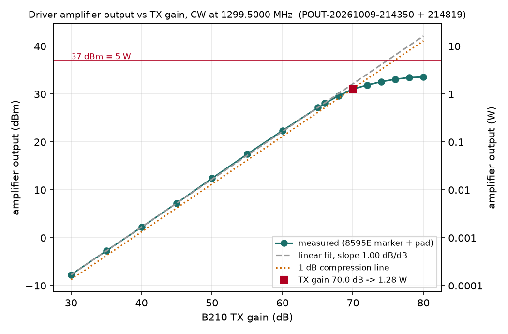

# Earth-Venus-Earth Modem — Control Station Integration Test Report

<!-- widths: 1.4,5.3 -->
| | |
|---|---|
| Document | DSES EVE Modem Control Station Integration Test Report |
| Revision | Rev A — DRAFT, in progress (bench 2026-10-09; Haswell feed integration 2026-10-10) |
| Date | 2026-10-09 |
| Prepared by | Rick Hambly, K0GD, Deep Space Exploration Society |
| Prepared for | DSES EVE-26 project team; Board report of 2026-10-13 |
| Unit under test | DSES control-station tray: USRP B210 s/n 8003886, Leo Bodnar GPS reference clock s/n D65EE73B3D, DIUSTOU DSTUR-T20 two-relay sequencer board, 5 W broadband driver amplifier (10 MHz–1.3 GHz, 36–41 dB, HQXRTEK module), Mean Well LRS-350-24 supply; EVE modem software 1.0.9 (bench runs through the development clone at the same version) |
| Funding | Supported by a grant from Amateur Radio Digital Communications. |
| Status | Section 3 (bench) complete 2026-10-09; section 4 (Haswell, with the 23 cm feed hardware) to be written on site 2026-10-10 |

This report records the integration tests of the control-station tray that carries the
EVE modem's radio, reference clock, sequencer and driver amplifier, first on the CNS
Systems bench (2026-10-09) and then at the DSES Plishner site at Haswell against the 23 cm
feed hardware (2026-10-10). It follows the Engineering Report structure of the house
standard: purpose and summary first, methods and caveats last. The modem itself is
described in the Design Description and ICD (`DSES_EVE_Modem_Design_and_ICD`, Rev C) and
operated per the Operator's Guide; this report cites their section numbers rather than
repeating them.

# 1. Purpose and summary

The tray is the modem's station package (ICD 7.1): the B210 on the GPS clock's 10 MHz and
1 PPS, the two-relay sequencer that keys the amplifier and protects the LNA (D24), and a
driver stage that feeds the LMR-600 run to the 1200 W amplifier at the feed. Before it
meets the feed hardware the team needs three things measured: that the modem brings the
tray up and keys it in the right order, the B210 TX gain that makes the driver deliver its
rated 5 W at 1299.5 MHz (the setting the signal-generator mode would be run at on site),
and that the signal-generator CW is on frequency.

Findings on the bench (2026-10-09):

- **The tray comes up from the modem.** GPS clock locked (OUT1 10 MHz at level 1, OUT2 off,
  which carries the 1 PPS); relay board found automatically on its COM port; B210 locked
  to the external reference and timed on a PPS edge (set error 0.000000 s, PPS verified,
  rate error +0.30 ppm). The B210 needed a true power cycle first: it had enumerated as
  "Unknown USB Device (Device Descriptor Request Failed)", the wedged-FX3 state seen on
  2026-08-19.
- **The sequencer keys the tray.** Two signal-generator sessions keyed the relay board
  (relay 2 = LNA first, 150 ms guard, then relay 1 = TX key; the reverse on release) in
  parallel with the B210 GPIO lines, 58 s and 52 s keyed, no faults, released cleanly.
- **The driver amplifier does not reach 5 W at 1299.5 MHz.** Its output follows the TX gain
  at 1.006 dB per dB up to about 0.5 W, reaches 1 dB compression between TX gain 68 and
  70 dB (+30.5 dBm, about 1.1 W), and saturates at +33.6 dBm, 2.3 W, at TX gain 80 dB.
  Its small-signal gain is about 41 dB at this frequency. The module's 5 W rating applies
  to the low end of its band. **Station consequence:** through the 10 dB LMR-600 run the
  feed would see at most 0.23 W, a tenth of the 2 W (+33 dBm) the 1200 W amplifier's
  pre-driver needs (ICD 7.1, D16, O4); a different driver, a shorter run or an amplifier
  stage at the feed is needed before the EME test.
- **The signal-generator CW is on frequency.** The 8595E marker counter read the CW at
  1299.500000 MHz on every step (some steps +100 Hz, the counter's resolution), with the
  B210 on the GPS clock.
- **The modem's bench loopback decoded through the tray hookup** with the production
  1.0.9 install (session BENCH-20261009-212042, TX gain 0, first symbols correct).
- A software gap was found and recorded for release 1.0.10: the conda environments ship
  UHD 4.10 without firmware images, so a cold (just-powered) B210 can only be brought up
  on a machine that also has radioconda's images (section 5).

Findings at Haswell (2026-10-10): TBD.

# 2. Configuration under test

## 2.1 Tray hookup on the bench (2026-10-09)

<!-- widths: 1.8,4.9 -->
| Path | Connection |
|---|---|
| B210 TX/RX A | Driver amplifier input, no pad (the amplifier's 41 dB gain means the B210 must stay well below its +10 dBm maximum; the modem's bench loopback runs use TX gain 0) |
| Driver amplifier output | 40 dB power attenuator (10 W) → Agilent 8595E spectrum analyzer (testbench Prologix GPIB-Ethernet adapter, address 18). Amplifier output = marker amplitude + 40 dB (pad loss nominal, not yet calibrated at 1299.5 MHz) |
| B210 RX2 A | Agilent E4438C signal generator (LAN 192.168.10.66), found at 1420.5 MHz, −80 dBm, RF on, no modulation (out of band for these runs, left as found) |
| B210 REF IN / PPS IN | Leo Bodnar GPS reference clock OUT1 (10 MHz, level 1 ≈ +11 dBm) / OUT2 (1 PPS with output 2 disabled) |
| Sequencer | DIUSTOU DSTUR-T20 on USB (STM32 virtual COM port, COM14 on this PC); relay 1 = TX key, relay 2 = LNA (energized = LNA off). Contacts not wired on the bench; the driver runs continuously from its 24 V supply |
| Amplifier supply | Mean Well LRS-350-24, 24 V, 115 V input |
| Host | Windows 11 development PC; EVE modem 1.0.9 (production install `C:\ProgramFiles\DSES-EVE-Modem`) for the loopback run, the development clone at the same version for the sweep tool |

## 2.2 Software and settings

- Application settings of record: bench mode, Variant A, dial 1296 MHz for the loopback
  run; external clock with the GPS clock preflight on; LNA guard and release 150 ms; TX
  port A, RX port A : RX2.
- Sweep tool `tools/eve_pout_sweep.py` (new with this report): a signal-generator session
  (the application's own `GeneratorSession`) with a CW at the dial, keyed through the
  sequencer, the TX gain stepped and the 8595E marker read over GPIB at each step after a
  4 s hold (peak search, marker counter at 100 Hz resolution, marker amplitude); the sweep
  stops at the target power, at a power ceiling, or at 1 dB compression unless told to
  continue; outputs a JSON record, the graph and the generator's one-page PDF. Marker
  reader for manual steps: `tools/eve_8595e.py`.
- Analyzer set-up for the measurement (set over GPIB on the operator's word and restored
  afterwards): centre 1299.5 MHz, span 2 MHz, RBW 10 kHz, VBW 10 kHz, reference level
  0 dBm, input attenuation 10 dB, sweep 60 ms. As found: full span 0–6.5 GHz, RBW 3 MHz,
  reference 0 dBm.

# 3. Bench results (2026-10-09)

## 3.1 Bring-up

<!-- widths: 1.6,5.1 -->
| Item | Result |
|---|---|
| GPS clock | Satellite and PLL lock true; OUT1 10 MHz, level 1; OUT2 off (1 PPS on the pin); one signal-loss event since power-up |
| Relay board | Found automatically on COM14 (USB VID 0483:5740), both relays off at open; both query back ON/OFF |
| B210 | Wedged at first (descriptor request failed); after a power cycle: serial 8003886, firmware and FPGA loaded (FPGA 16.0), USB 3, external reference locked, device time set on a PPS edge (set error 0.000000 s), PPS verified, sample-rate error +0.30 ppm, TX and RX LO offsets honored at 1299.5 MHz |
| Modem loopback (production 1.0.9) | Session BENCH-20261009-212042: dial 1296 MHz, TX gain 0, RX gain 0, first two symbols decoded correctly, two chunks keyed, aborted by the operator at 20 s (Switching "none") |

## 3.2 Sequencer

The two sweep sessions (POUT-20261009-214350 and POUT-20261009-214819) keyed through
"sequencer: USB relay board COM14 + B210 GPIO": at key-down the LNA relay (relay 2)
energizes, the 150 ms guard elapses, the TX relay (relay 1) energizes, then the 200 ms key
lead runs before the RF starts; at release the RF stops, the 100 ms lag runs, the TX relay
releases, the 150 ms release time elapses, and the LNA relay releases. Each board frame was
acknowledged; no key-line fault was logged; the sessions were keyed for 58.2 s and 51.7 s
and released cleanly at the end of each sweep. The relay timing has not yet been measured
on the scope (the contacts were unwired on the bench); that is a Haswell item.

## 3.3 Driver amplifier output versus TX gain at 1299.5 MHz

Two sweeps, 30–70 dB in 5 dB steps (stopped by the tool's 1 dB compression rule) and
66–80 dB in 2 dB steps (continued past compression on the operator's word), merged below.
"Linear" is the fit through the 30–60 dB rows (slope 1.006 dB/dB, intercept −37.96 dBm);
the last column is how far the output falls below that line.

<!-- widths: 1.0,1.2,1.2,1.0,1.3,1.0 -->
| TX gain (dB) | Marker (dBm) | Amplifier out (dBm) | Watts | Counted frequency (MHz) | Below linear (dB) |
|---|---|---|---|---|---|
| 30 | −47.72 | −7.72 | 0.000 | 1299.500100 | 0.0 |
| 35 | −42.73 | −2.73 | 0.001 | 1299.500100 | 0.0 |
| 40 | −37.79 | +2.21 | 0.002 | 1299.500100 | 0.1 |
| 45 | −32.75 | +7.25 | 0.005 | 1299.500000 | 0.1 |
| 50 | −27.59 | +12.41 | 0.017 | 1299.500000 | 0.0 |
| 55 | −22.54 | +17.46 | 0.056 | 1299.500100 | 0.0 |
| 60 | −17.62 | +22.38 | 0.173 | 1299.500000 | 0.0 |
| 65 | −12.84 | +27.16 | 0.520 | 1299.500000 | 0.3 |
| 66 | −11.93 | +28.07 | 0.641 | 1299.500000 | 0.4 |
| 68 | −10.32 | +29.68 | 0.929 | 1299.500000 | 0.8 |
| 70 | −8.94 | +31.06 | 1.276 | 1299.500100 | 1.4 |
| 72 | −8.12 | +31.88 | 1.542 | 1299.500000 | 2.6 |
| 74 | −7.42 | +32.58 | 1.811 | 1299.500100 | 3.9 |
| 76 | −6.90 | +33.10 | 2.042 | 1299.500100 | 5.4 |
| 78 | −6.55 | +33.45 | 2.213 | 1299.500000 | 7.1 |
| 80 | −6.43 | +33.57 | 2.275 | 1299.500000 | 9.0 |

Results:

- 1 dB compression between TX gain 68 and 70 dB: about +30.5 dBm, 1.1 W (the 70 dB row
  is 1.4 dB under the line, the 68 dB row 0.8 dB).
- Saturated output +33.6 dBm, 2.3 W, at TX gain 80 dB; the last 4 dB of gain added
  0.5 dB of output.
- 5 W (+37 dBm) is not reachable at this frequency.
- Small-signal gain about 41 dB (B210 output about −10 dBm at TX gain 70 dB by the B210's
  published curve; not measured directly).
- Settings for the station: TX gain 65 dB gives 0.5 W in the linear region; 70 dB gives
  1.3 W at the 1 dB point; nothing above 76 dB adds useful power.

## 3.4 Frequency

With the B210 on the GPS clock, the 8595E's marker counter (100 Hz resolution) read the
signal-generator CW at 1299.500000 MHz on 10 of the 16 steps and 1299.500100 MHz on the
other six, i.e. on frequency to the analyzer's resolution; this confirms that the
signal-generator mode's "CW at the dial" places the carrier at the dial frequency with no
IF or LO-offset error. The analyzer's own timebase limits this check to about 1 part in 10^7
(130 Hz); the definitive measurement is the 53230A counter run of 2026-09-12 on the same
transmit chain (comb tone within 0.03 Hz of the lab reference, ICD 5.4, O16).

# 4. Haswell results (2026-10-10)

To be written on site. Planned content:

- the tray's connection to the 23 cm feed hardware (driver output into the LMR-600 run,
  the 1200 W amplifier's drive and keying, LNA protection wiring, DC control), and what
  the 2.3 W driver limit of section 3.3 means for the drive at the feed;
- bring-up on the site computer (clock lock, relay board port, B210; see the UHD images
  caveat in section 5 for a machine without radioconda);
- sequencer timing against the station's amplifier and LNA switching (scope on the relay
  contacts: order, guard and release times);
- drive level set from section 3.3 and the amplifier chain's response;
- a receive check through the feed;
- any modem or report changes made on site.

# 5. Methods and caveats

- Lab rules (CNS Systems TEST_EQUIPMENT.md) applied: the 8595E's measurement set-up was
  read back and recorded; it was changed only on the operator's word for this measurement
  and restored afterwards; the marker peak search and counter are readings; one GPIB
  session per visit, the analyzer handed back in local. The E4438C was read and left as
  found.
- The 40 dB pad's loss is nominal until calibrated at 1299.5 MHz with the E4438C (busy on
  RX2 A during these runs). The absolute power figures carry that uncertainty (typically
  within ±0.5 dB for a 10 W SMA attenuator at 1.3 GHz) plus the 8595E's amplitude accuracy
  (about ±1.5 dB absolute at this frequency and attenuation; the relative shape of the
  curve, and so the compression and saturation points, are better than that).
- The 8595E's frequency reading is limited by its own timebase unless it is on the lab
  10 MHz reference (not checked); the definitive frequency check remains the 53230A
  measurement of 2026-09-12 on the same transmit chain.
- The amplifier was keyed for under a minute per sweep with its fan running; no thermal
  characterization was attempted. The sweep ceiling of TX gain 80 dB (about 0 dBm into the
  amplifier) was the operator's decision; the module's listing gives no input rating.
- UHD images: both conda environments carry UHD 4.10 with no `share/uhd/images`; the
  modem's shared radio layer (`dses_radio.ensure_uhd_images`) falls back to radioconda's
  images, which this PC and the Mac have. Release 1.0.10 will stage the b2xx images in
  the environment and export the path in the launchers. Until then, a cold B210 on a
  machine without radioconda must be brought up once with a UHD that has images.
- Records: `docs/test_reports/data/POUT-20261009-214350_pout.json` and `..._214819_pout.json`
  (every row, the analyzer set-up as found and as set, the radio and GPS state, the
  session log), the merged rows in `docs/test_reports/figures/pout_sweep_merged.json`,
  and the generator sessions' own one-page reports.

# Revision history

| Rev | Date | Change |
|---|---|---|
| A — DRAFT | 2026-10-09 | Bench: configuration, bring-up, sequencer, the driver amplifier sweep at 1299.5 MHz (1 dB compression about 1.1 W, saturation 2.3 W, 5 W not reachable), frequency check; section 4 reserved for Haswell 2026-10-10 |
